# Reinforement Learning

## Reinforcement Learning


**强化学习讨论的问题是一个 智能体(agent) 怎么在一个复杂不确定的环境(environment)里面去极大化它能获得的奖励。**示意图由两部分组成：agent 和 environment。在强化学习过程中，agent 跟 environment 一直在交互。Agent 在环境里面获取到状态，agent 会利用这个状态输出一个 action，一个决策。然后这个决策会放到环境之中去，环境会通过这个 agent 采取的决策，输出下一个状态以及当前的这个决策得到的奖励。Agent 的目的就是为了尽可能多地从环境中获取奖励。


我们可以把强化学习跟监督学习做一个对比。上图说的是 `supervised learning`。举个图片分类的例子，监督学习就是说我们有一大堆标定的数据，比如车、飞机、凳子这些标定的图片，这些图片都要满足 i.i.d 分布，就是它们之间是没有关联的一个分布。然后我们训练一个分类器，比如说右边这个神经网络。为了分辨出这个图片是车辆还是飞机，训练过程中，我们把真实的 label 给了这个网络。当这个网络做出一个错误的预测，比如现在输入了这个汽车的图片，它预测出来是飞机。我们就会直接告诉它，你这个预测是错误的，正确的 label 应该是车。然后我们把这个错误写成一个`损失函数(loss function)`，通过 Backpropagation 来训练这个网络。所以在监督学习过程中，有两个假设，

* 输入的数据，标定的数据，它都是没有关联的，尽可能没有关联。因为如果有关联的话，这个网络是不好学习的。
* 我们告诉这个 learner 正确的标签是什么，这样它可以通过正确的标签来修正自己的这个预测。


在强化学习里面，这两点其实都不满足。举一个 Atari Breakout 游戏的例子，这是一个打砖块的游戏，控制木板，然后把这个球反弹到上面来消除这些砖块。

* 在游戏过程中，大家可以发现这个 agent 得到的观测不是个 i.i.d 的分布，上一帧下一帧其实有非常强的连续性。
* 另外一点，在玩游戏的过程中，你并没有立刻获得这个反馈。比如你现在把这个木板往右移，那么只会使得这个球往上或者往左上去一点，你并不会得到立刻的反馈。所以强化学习这么困难的原因是没有得到很好的反馈，然后你依然希望这个 agent 在这个环境里面学习。


强化学习的训练数据就是这样一个玩游戏的过程。你从第一步开始，采取一个决策，比如说你把这个往右移，接到这个球了。第二步你又做出决策，得到的 training data 是一个玩游戏的序列。

比如现在是在第三步，你把这个序列放进去，你希望这个网络可以输出一个决策，在当前的这个状态应该输出往右移或者往左移。这里有个问题，就是我们没有标签来说明你现在这个动作是正确还是错误，必须等到这个游戏结束可能，这个游戏可能十秒过后才结束。现在这个动作往左往右到底是不是对最后游戏的结束能赢有帮助，其实是不清楚的的。这里就面临一个`延迟奖励(Delayed Reward)`，所以就使得训练这个网络非常困难。


**我们对比下强化学习和监督学习。**

* 首先强化学习输入的序列的数据并不是像 supervised learning 里面这些样本都是独立的。
* 另外一点是 learner 并没有被告诉你每一步正确的行为应该是什么。Learner 不得不自己去发现哪些行为可以使得它最后得到这个奖励，只能通过不停地尝试来发现最有利的 action。  

* 这里还有一点是 agent 获得自己能力的过程中，其实是通过不断地试错(trial-and-error exploration)。Exploration 和 exploitation 是强化学习里面非常核心的一个问题。Exploration 是说你会去尝试一些新的行为，这些新的行为有可能会使你得到更高的奖励，也有可能使你一无所有。Exploitation 说的是你就是就采取你已知的可以获得最大奖励的行为，你就重复执行这个 action 就可以了，因为你已经知道可以获得一定的奖励。因此，我们需要在 exploration 和 exploitation 之间取得一个权衡，这也是在监督学习里面没有的情况。

* 在强化学习过程中，没有非常强的 supervisor，只有一个`奖励信号(reward signal)`，就是环境会在很久以后告诉你之前你采取的行为到底是不是有效的。Agent 在这个强化学习里面学习的话就非常困难，因为你没有得到即时反馈。当你采取一个行为过后，如果是监督学习，你就立刻可以获得一个指引，就说你现在做出了一个错误的决定，那么正确的决定应该是谁。而在强化学习里面，环境可能会告诉你这个行为是错误的，但是它并没有告诉你正确的行为是什么。而且更困难的是，它可能是在一两分钟过后告诉你错误，它再告诉你之前的行为到底行不行。所以这也是强化学习和监督学习不同的地方。

通过跟监督学习比较，我们可以总结出这个强化学习的一些特征。

* 首先它是有这个 `trial-and-error exploration`，它需要通过探索环境来获取对这个环境的理解。
* 第二点是强化学习 agent 会从环境里面获得延迟的奖励。
* 第三点是在强化学习的训练过程中，时间非常重要。因为你得到的数据都是有这个时间关联的，而不是这个 i.i.d 分布的。在机器学习中，如果观测数据有非常强的关联，其实会使得这个训练非常不稳定。这也是为什么在监督学习中，我们希望 data 尽量是  i.i.d 了，这样就可以消除数据之间的相关性。
* 第四点是这个 agent 的行为会影响它随后得到的数据，这一点是非常重要的。在我们训练 agent 的过程中，很多时候我们也是通过正在学习的这个 agent 去跟环境交互来得到数据。所以如果在训练过程中，这个 agent 的模型很快死掉了，那会使得我们采集到的数据是非常糟糕的，这样整个训练过程就失败了。所以在强化学习里面一个非常重要的问题就是怎么让这个 agent 的行为一直稳定地提升。


为什么我们关注这个强化学习，其中非常重要的一点就是强化学习得到的这个模型可以取得超人类的结果。监督学习获取的这些监督数据，其实是让人来标定的。比如说 ImageNet，这些图片都是人类标定的。那么我们就可以确定这个算法的 upper bound(上限)，人类的这个标定结果决定了它永远不可能超越人类。但是对于强化学习，它在环境里面自己探索，有非常大的潜力，它可以获得超越人的能力的这个表现，比如说 AlphaGo，谷歌 DeepMind 的 AlphaGo 这样一个强化学习的算法可以把人类最强的棋手都打败。


这里给大家举一些在现实生活中强化学习的例子。

* 国际象棋是一个强化学习的过程，因为这个棋手就是在做出一个选择来跟对方对战。
* 在自然界中，羚羊其实也是在做一个强化学习，它刚刚出生的时候，可能都不知道怎么站立，然后它通过 `trial- and-error` 的一个尝试，三十分钟过后，它就可以跑到每小时 36 公里，很快地适应了这个环境。

* 你也可以把股票交易看成一个强化学习的问题，就怎么去买卖来使你的收益极大化。
* 玩雅达利游戏或者一些电脑游戏，也是一个强化学习的过程。


上图是强化学习的一个经典例子，就是雅达利的一个叫 Pong 的游戏。这个游戏就是把这个球拍到左边，然后左边这个选手需要把这个球拍到右边。训练好的一个强化学习 agent 和正常的选手有区别，强化学习的 agent 会一直在做这种无意义的一些振动，而正常的选手不会出现这样的行为。


在这个 pong 的游戏里面，决策其实就是两个动作：往上或者往下。如果强化学习是通过学习一个 policy network 来分类的话，其实就是输入当前帧的图片，然后 policy network 就会输出所有决策的可能性。


在这种情况下面，对于监督学习的话，我们就可以直接告诉这个 agent 正确的 label 是什么。在这种游戏情况下面，我们并不知道它的正确的标签是什么。


在强化学习里面，我们是通过让它尝试去玩这个游戏，然后直到游戏结束过后，再去说你前面的一系列动作到底是正确还是错误。


上图的过程是 `rollout` 的一个过程。Rollout 的意思是从当前帧去生成很多局的游戏。然后这个很多局就通过是你当前的这个网络去跟这个环境交互，你就会得到一堆这个观测。你可以把每一个观测看成一个`轨迹(trajectory)`，轨迹的话就是当前帧以及它采取的策略，每一步的这个策略都有。最后结束过后，你会知道你到底有没有把这个球击到对方区域，对方没有接住，你是赢了还是输了。我们可以通过观测序列以及 Eventual Reward 来训练这个 agent ，使它尽可能地采取最后可以获得这个 Eventual Reward 的过程。


强化学习是有一定的历史的，只是最近大家把强化学习跟深度学习结合起来，就形成了`深度强化学习(Deep Reinforcemet Learning)`。这里做一个类比，把它类比于这个传统的计算机视觉以及深度计算机视觉。

* 传统的计算机视觉由两个过程组成。你给一张图，我们先要提取它的特征，用一些设计好的 feature，比如说 HOG、DPM。提取这些 feature 后，我们再单独训练一个分类器。这个分类器可以是 SVM、Boosting，然后就可以辨别这张图片是狗还是猫。 

* 2012 年过后，我们有了卷积神经网络，大家就把特征提取以及分类两者合到一块儿去了，就是训练一个神经网络。这个神经网络既可以做特征提取，也可以做分类。它可以实现这种端到端的一个训练，它里面的参数可以在每一个阶段都得到极大的优化，这样就得到了一个非常重要的突破。


我们可以把神经网络放到强化学习里面。

* 之前的强化学习，比如 TD-Gammon  玩 backgammon 这个游戏，它其实是设计特征，然后通过训练价值函数的一个过程，就是它先设计了很多手工的特征，这个手工特征可以描述现在整个状态。得到这些特征过后，它就可以通过训练一个分类网络或者分别训练一个价值估计函数来做出决策。
* 现在我们有了深度学习，有了神经网络，那么大家也把这个过程改进成一个 end-to-end training 的过程。你直接输入这个状态，我们不需要去手工地设计这个特征，就可以让它直接输出 action。那么就可以用一个神经网络来拟合我们这里的 value function 或 policy network，省去 了 feature engineering 的过程。


为什么强化学习在这几年就用到各种应用中去，比如玩游戏以及机器人的一些应用，并且取得了可以击败人类最好棋手的一个结果。

这由几点组成：

* 我们有了更多的计算能力，有了更多的 GPU，可以更快地做更多的 trial-and-error 的尝试。
* 通过这种不同尝试使得 agent 在这个环境里面获得很多信息，然后可以在这个环境里面取得很大的奖励。
* 我们有了这个端到端的一个训练，可以把特征提取和价值估计或者决策一块来优化，这样就可以得到了一个更强的决策网络。


 接下来给大家再看一些强化学习里面比较有意思的例子。

*  **第一个例子是 DeepMind 研发的一个走路的 agent。**这个 agent 往前走一步，你就会得到一个 reward。这个 agent 有不同的这个形态，可以学到很多有意思的功能。比如怎么跨越这个障碍物，就像那个蜘蛛那样的 agent 。怎么跨越障碍物，像这个人有双腿一样， 这个 agent 往前走。以及像这个人形 的agent，怎么在一个曲折的道路上面往前走。这个结果也是非常有意思，这个人形 agent 会把手举得非常高，因为它这个手的功能就是为了使它身体保持平衡，这样它就可以更快地在这个环境里面往前跑，而且这里你也可以增加这个环境的难度，加入一些扰动，这个 agent 就会变得更鲁棒。
*  **第二个例子是机械臂抓取。**因为这个机械臂的应用自动去强化学习需要大量的这个 rollout，所以它这里就有好多机械臂。然后分布式系统可以让这个机械臂尝试抓取不同的物体。你发现这个盘子里面物体的形状、形态其实都是不同的，这样就可以让这个机械臂学到一个统一的行为。然后在不同的抓取物下面都可以采取最优的一个抓取特征。你的这个抓取的物件形态存在很多不同，一些传统的这个抓取算法就没法把所有物体都抓起来，因为你对每一个物体都需要做一个建模，这样的话就是非常花时间。但是通过强化学习，你就可以学到一个统一的抓取算法，在不同物体上它都可以适用。
*  **第三个例子是 OpenAI 做的一个机械臂翻魔方**。这里它们 18 年的时候先设计了这个手指的一个机械臂，让它可以通过翻动手指，使得手中的这个木块达到一个预定的设定。人的手指其实非常精细，怎么使得这个机械手臂也具有这样灵活的能力就一直是个问题。它们通过这个强化学习在一个虚拟环境里面先训练，让 agent 能翻到特定的这个方向，再把它应用到真实的手臂之中。这在强化学习里面是一个比较常用的做法，就是你先在虚拟环境里面得到一个很好的 agent，然后再把它使用到真实的这个机器人中。因为真实的机械手臂通常都是非常容易坏，而且非常贵，你没法大批量地购买。2019年对手臂进一步改进了，这个手臂可以玩魔方了。这个结果也非常有意思，到后面，这个魔方就被恢复成了个六面都是一样的结构了。
*  **第四个例子是一个穿衣服的 agent ，就是训练这个 agent 穿衣服。**因为很多时候你要在电影或者一些动画实现这个人穿衣的这种场景，通过手写执行命令让机器人穿衣服其实非常困难。很多时候穿衣服也是一个非常精细的操作，那么它们这个工作就是训练这个强化学习 agent，然后就可以实现这个穿衣功能。这里你还可以加入一些扰动，然后 agent 可以抗扰动。可能有这种 failure case， agent 就穿不进去，就卡在这个地方。

## Introduction to Sequential Decision Making

### Agent and Environment


接下来我们讲`序列决策(Sequential Decision Making)过程`。强化学习研究的问题是 agent 跟环境交互，上图左边画的是一个 agent，agent 一直在跟环境进行交互。这个 agent 把它输出的动作给环境，环境取得这个动作过后，会进行到下一步，然后会把下一步的观测跟它上一步是否得到奖励返还给 agent。通过这样的交互过程会产生很多观测，agent 就是为了从这些观测之中学到能极大化奖励的策略。

### Reward


**奖励是由环境给的一个反馈信号**，这个信号指定了这个 agent 在某一步采取了某个策略是否得到奖励。强化学习的目的就是为了极大化 agent 可以获得的奖励，agent 在这个环境里面存在的目的就是为了极大它的期望积累的奖励。


这里给大家举一些奖励的例子。不同的环境，奖励也是不同的。

* 比如说一个下象棋的选手，它的目的其实就为了赢棋。奖励是说在最后棋局结束的时候，他知道会得到一个正奖励或者负奖励。
* 羚羊站立也是一个强化学习过程，它得到的奖励就是它是否可以最后跟它妈妈一块离开或者它被吃掉。
* 在股票管理里面，奖励定义由你的股票获取的收益跟损失决定。
* 在玩雅达利游戏的时候，奖励就是你有没有在增加游戏的分数，奖励本身的稀疏程度决定了这个游戏的难度。

### Sequential Decision Making


在一个强化学习环境里面，agent 的目的就是选取一系列的动作来极大化它的奖励，所以这些采取的动作必须有长期的影响。但在这个过程里面，它的奖励其实是被延迟了，就是说你现在采取的某一步决策可能要等到时间很久过后才知道这一步到底产生了什么样的影响。

这里一个示意图就是我们玩这个 Atari 的 Pong 游戏，你可能只有到最后游戏结束过后，才知道这个球到底有没有击打过去。中间你采取的 up 或 down 行为，并不会直接产生奖励。强化学习里面一个重要的课题就是近期奖励和远期奖励的一个 trade-off。怎么让 agent 取得更多的长期奖励是强化学习的问题。


在跟环境的交互过程中，agent 会获得很多观测。在每一个观测会采取一个动作，它也会得到一个奖励。**所以历史是观测、行为、奖励的序列：**
$$
H_{t}=O_{1}, R_{1}, A_{1}, \ldots, A_{t-1}, O_{t}, R_{t}
$$
Agent 在采取当前动作的时候会依赖于它之前得到的这个历史，**所以你可以把整个游戏的状态看成关于这个历史的函数：**
$$
S_{t}=f\left(H_{t}\right)
$$
Q: 状态和观测有什么关系?

A: `状态(state)` $s$ 是对世界的完整描述，不会隐藏世界的信息。`观测(observation)` $o$ 是对状态的部分描述，可能会遗漏一些信息。

在 deep RL 中，我们几乎总是用一个实值的向量、矩阵或者更高阶的张量来表示状态和观测。举个例子，我们可以用 RGB 像素值的矩阵来表示一个视觉的观测，我们可以用机器人关节的角度和速度来表示一个机器人的状态。


在 agent 的内部也有一个函数来更新这个状态。当 agent 的状态跟环境的状态等价的时候，我们就说这个环境是 `full observability`，就是全部可以观测。换句话说，当 agent 能够观察到环境的所有状态时，我们称这个环境是`完全可观测的(fully observed)`。


但是有一种情况是 agent 得到的观测并不能包含所有环境运作的状态，因为在这个强化学习的设定里面，环境的状态才是真正的所有状态。比如 agent 在玩这个 black jack 这个游戏，它能看到的其实是牌面上的牌。或者在玩雅达利游戏的时候，观测到的只是当前电视上面这一帧的信息，你并没有得到游戏内部里面所有的运作状态。也就是说当 agent 只能看到部分的观测，我们就称这个环境是`部分可观测的(partially observed)`。在这种情况下面，强化学习通常被建模成一个 POMDP 的问题。

`部分可观测马尔可夫决策过程(Partially Observable Markov Decision Processes, POMDP)`是一个马尔可夫决策过程的泛化。POMDP 依然具有马尔可夫性质，但是假设智能体无法感知环境的状态 $s$，只能知道部分观测值 $o$。比如在自动驾驶中，智能体只能感知传感器采集的有限的环境信息。

POMDP 可以用一个 7 元组描述：$(S,A,T,R,\Omega,O,\gamma)$，其中 $S$ 表示状态空间，为隐变量，$A$ 为动作空间，$T(s'|s,a)$ 为状态转移概率，$R$ 为奖励函数，$\Omega(o|s,a)$ 为观测概率，$O$ 为观测空间，$\gamma$ 为折扣系数。

## Action Spaces

不同的环境允许不同种类的动作。在给定的环境中，有效动作的集合经常被称为`动作空间(action space)`。像 Atari 和 Go 这样的环境有`离散动作空间(discrete action spaces)`，在这个动作空间里，agent 的动作数量是有限的。在其他环境，比如在物理世界中控制一个 agent，在这个环境中就有`连续动作空间(continuous action spaces)` 。在连续空间中，动作是实值的向量。 

例如，

* 走迷宫机器人如果只有东南西北这 4 种移动方式，则其为离散动作空间；
* 如果机器人向 $360^{\circ}$ 中的任意角度都可以移动，则为连续动作空间。

## Major Components of an RL Agent 


对于一个强化学习 agent，它有如下组成成分：

* 首先 agent 有一个 `policy function`，agent 会用这个函数来选取下一步的动作。

* 然后它也可能生成一个`价值函数(value function)`。我们用价值函数来对当前状态进行估价，它就是说你进入现在这个状态，可以对你后面的收益带来多大的影响。当这个价值函数大的时候，说明你进入这个状态越有利。

* 另外一个组成成分是`模型(model)`。模型表示了 agent 对这个环境的状态进行了理解，它决定了这个世界是如何进行的。

### Policy


我们深入看这三个组成成分的一些细节。

Policy 决定了这个 agent 的行为，它其实是一个函数，把输入的状态变成行为。这里有两种 policy：

* 一种是 `stochastic policy(随机性策略)`，它就是 $\pi$ 函数 $\pi(a | s)=P\left[A_{t}=a | S_{t}=s\right]$ 。当你输入一个状态 $s$ 的时候，输出是一个概率。这个概率就是你所有行为的一个概率，然后你可以进一步对这个概率分布进行采样，得到真实的你采取的行为。比如说这个概率可能是有 70% 的概率往左，30% 的概率往右，那么你通过采样就可以得到一个 action。

* 一种是 `deterministic policy(确定性策略)`，就是说你这里有可能只是采取它的极大化，采取最有可能的动作。你现在这个概率就是事先决定好的。

从  Atari 游戏来看的话，policy function 的输入就是游戏的一帧，它的输出决定你是往左走或者是往右走。

通常情况下，强化学习一般使用`随机性策略`。随机性策略有很多优点：

* 在学习时可以通过引入一定随机性来更好地探索环境；

* 随机性策略的动作具有多样性，这一点在多个智能体博弈时也非常重要。采用确定性策略的智能体总是对同样的环境做出相同的动作，会导致它的策略很容易被对手预测。

### Value Function

**价值函数是未来奖励的一个预测，用来评估状态的好坏**。

价值函数里面有一个 discount factor，我们希望尽可能在短的时间里面得到尽可能多的奖励。如果我们说十天过后，我给你 100 块钱，跟我现在给你 100 块钱，你肯定更希望我现在就给你 100 块钱，因为你可以把这 100 块钱存在银行里面，你就会有一些利息。所以我们就通过把这个 `discount factor` 放到价值函数的定义里面，价值函数的定义其实是一个期望。这里有一个期望 $\mathbb{E}_{\pi}$，这里有个小角标是 $\pi$ 函数，这个 $\pi$ 函数就是说在我们已知某一个 policy function 的时候，到底可以得到多少的奖励。

我们还有一种价值函数：Q 函数。Q 函数里面包含两个变量：状态和动作。所以你未来可以获得多少的奖励，它的这个期望取决于你当前的状态和当前的行为。这个 Q 函数是强化学习算法里面要学习的一个函数。因为当我们得到这个 Q 函数后，进入某一种状态，它最优的行为就可以通过这个 Q 函数来得到。

### Model

第三个组成部分是模型，**模型决定了下一个状态会是什么样的，就是说下一步的状态取决于你当前的状态以及你当前采取的行为。**它由两个部分组成，

* 一个是 probability，它这个转移状态之间是怎么转移的。

* 另外是这个奖励函数，当你在当前状态采取了某一个行为，可以得到多大的奖励。


当我们有了这三个成分过后，就形成了一个 `Markov Decision Process`。这个决策过程可视化了状态之间的转移以及采取的行为。


这里我们来看一个走迷宫的例子，这个例子要求 agent 从 start 开始，然后到达 goal 的位置。这里设定的奖励是每走一步，你就会得到一个负的奖励。这里可以采取的动作是往上下左右走。当前状态用现在 agent 所在的位置来描述。


我们可以用不同的强化学习算法来解这个环境，如果我们采取的是 `Policy-based RL`，当我们学习好了这个环境过后，在每一个状态，我们就会得到一个最佳的行为。比如说现在在第一格开始的时候，我们知道它最佳行为是往右走，然后第二格的时候，得到的最佳策略是往上走，第三格是往右走。通过这个最佳的策略，我们就可以最快地到达终点。


如果换成 `value-based RL` 这个算法，利用价值函数来作为导向，我们就会得到另外一种表征。这里就表征了你每一个状态会返回一个价值，比如说你在 start 位置的时候，价值是 -16，因为你最快可以 16 步到达终点。因为每走一步会减一，所以你这里的价值是 -16。当我们快接近最后终点的时候，这个数字变得越来越大。在拐角的时候，比如要现在在第二格 -15。然后 agent 会看上下，它看到上面值变大了，变成 -14 了，它下面是 -16，那么这个 agent 肯定就会采取一个往上走的策略。所以通过这个学习的值的不同，我们可以抽取出现在最佳的策略。

## Types of RL Agents


**根据强化学习 agent 的不同，我们可以把 agent 进行归类。**

* **基于价值函数的 agent。**这一类 agent 显式地学习的是价值函数，隐式地学习了它的策略。因为这个策略是从我们学到的价值函数里面推算出来的。
* **基于策略的 agent**，它直接去学习 policy，就是说你直接给它一个 state，它就会输出这个动作的概率。在这个 policy-based agent 里面并没有去学习它的价值函数。
* **把 value-based 和 policy-based 结合起来就有了 `Actor-Critic agent`。**这一类 agent 就把它的策略函数和价值函数都学习了，然后通过两者的交互得到一个最佳的行为。

Q: 基于策略迭代和基于价值迭代的强化学习方法有什么区别?

A: 对于一个状态转移概率已知的马尔可夫决策过程，我们可以使用动态规划算法来求解；从决策方式来看，强化学习又可以划分为基于策略迭代的方法和基于价值迭代的方法。`决策方式`是智能体在给定状态下从动作集合中选择一个动作的依据，它是静态的，不随状态变化而变化。

在`基于策略迭代`的强化学习方法中，智能体会`制定一套动作策略`（确定在给定状态下需要采取何种动作），并根据这个策略进行操作。强化学习算法直接对策略进行优化，使制定的策略能够获得最大的奖励。

而在`基于价值迭代`的强化学习方法中，智能体不需要制定显式的策略，它`维护一个价值表格或价值函数`，并通过这个价值表格或价值函数来选取价值最大的动作。基于价值迭代的方法只能应用在不连续的、离散的环境下（如围棋或某些游戏领域），对于行为集合规模庞大、动作连续的场景（如机器人控制领域），其很难学习到较好的结果（此时基于策略迭代的方法能够根据设定的策略来选择连续的动作)。

基于价值迭代的强化学习算法有 Q-learning、 Sarsa 等，而基于策略迭代的强化学习算法有策略梯度算法等。此外， Actor-Critic 算法同时使用策略和价值评估来做出决策，其中，智能体会根据策略做出动作，而价值函数会对做出的动作给出价值，这样可以在原有的策略梯度算法的基础上加速学习过程，取得更好的效果。


**另外，我们是可以通过 agent 到底有没有学习这个环境模型来分类。**

* 第一种是 `model-based(有模型)` RL agent，它通过学习这个状态的转移来采取动作。
* 另外一种是 ` model-free(免模型)` RL agent，它没有去直接估计这个状态的转移，也没有得到环境的具体转移变量。它通过学习 value function 和 policy function 进行决策。这种 model-free 的模型里面没有一个环境转移的模型。

我们可以用马尔可夫决策过程来定义强化学习任务，并表示为四元组 $<S,A,P,R>$，即状态集合、动作集合、状态转移函数和奖励函数。如果这四元组中所有元素均已知，且状态集合和动作集合在有限步数内是有限集，则机器可以对真实环境进行建模，构建一个虚拟世界来模拟真实环境的状态和交互反应。

具体来说，当智能体知道状态转移函数 $P(s_{t+1}|s_t,a_t)$ 和奖励函数 $R(s_t,a_t)$ 后，它就能知道在某一状态下执行某一动作后能带来的奖励和环境的下一状态，这样智能体就不需要在真实环境中采取动作，直接在虚拟世界中学习和规划策略即可。这种学习方法称为`有模型学习`。


上图是有模型强化学习的流程图。

然而在实际应用中，智能体并不是那么容易就能知晓 MDP 中的所有元素的。**通常情况下，状态转移函数和奖励函数很难估计，甚至连环境中的状态都可能是未知的，这时就需要采用免模型学习。**免模型学习没有对真实环境进行建模，智能体只能在真实环境中通过一定的策略来执行动作，等待奖励和状态迁移，然后根据这些反馈信息来更新行为策略，这样反复迭代直到学习到最优策略。

Q: 有模型强化学习和免模型强化学习有什么区别？

A: 针对是否需要对真实环境建模，强化学习可以分为有模型学习和免模型学习。

* 有模型学习是指根据环境中的经验，构建一个虚拟世界，同时在真实环境和虚拟世界中学习；

* 免模型学习是指不对环境进行建模，直接与真实环境进行交互来学习到最优策略。

总的来说，有模型学习相比于免模型学习仅仅多出一个步骤，即对真实环境进行建模。因此，一些有模型的强化学习方法，也可以在免模型的强化学习方法中使用。在实际应用中，如果不清楚该用有模型强化学习还是免模型强化学习，可以先思考一下，在智能体执行动作前，是否能对下一步的状态和奖励进行预测，如果可以，就能够对环境进行建模，从而采用有模型学习。

免模型学习通常属于数据驱动型方法，需要大量的采样来估计状态、动作及奖励函数，从而优化动作策略。例如，在 Atari 平台上的 Space Invader 游戏中，免模型的深度强化学习需要大约 2 亿帧游戏画面才能学到比较理想的效果。相比之下，有模型学习可以在一定程度上缓解训练数据匮乏的问题，因为智能体可以在虚拟世界中行训练。

免模型学习的泛化性要优于有模型学习，原因是有模型学习算需要对真实环境进行建模，并且虚拟世界与真实环境之间可能还有差异，这限制了有模型学习算法的泛化性。

有模型的强化学习方法可以对环境建模，使得该类方法具有独特魅力，即“想象能力”。在免模型学习中，智能体只能一步一步地采取策略，等待真实环境的反馈；而有模型学习可以在虚拟世界中预测出所有将要发生的事，并采取对自己最有利的策略。

**目前，大部分深度强化学习方法都采用了免模型学习**，这是因为：

* 免模型学习更为简单直观且有丰富的开源资料，像 DQN、AlphaGo 系列等都采用免模型学习；
* 在目前的强化学习研究中，大部分情况下环境都是静态的、可描述的，智能体的状态是离散的、可观察的（如 Atari 游戏平台），这种相对简单确定的问题并不需要评估状态转移函数和奖励函数，直接采用免模型学习，使用大量的样本进行训练就能获得较好的效果。


把几类模型放到同一个 pie chart 里面。三个组成部分：value function、policy、model。按一个 agent 具不具有三者中的两者或者一者可以把它分成很多类。

## Learning and Planning

Learning 和 Planning 是序列决策的两个基本问题。

### Reinforcement Learning 

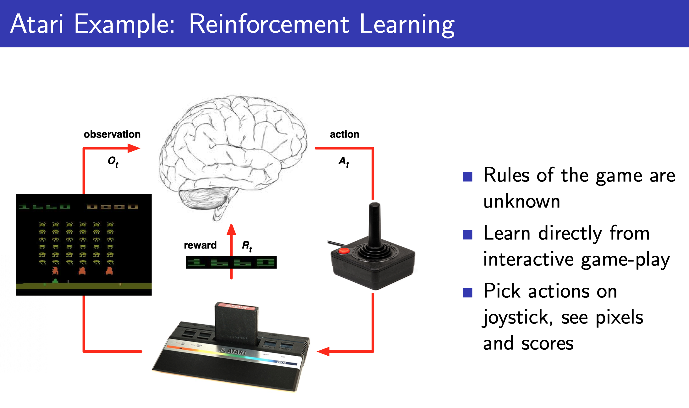

在 reinforcement learning 中，环境初始时是未知的，agent 不知道环境如何工作，agent 通过不断地与环境交互，逐渐改进策略。

### Planning

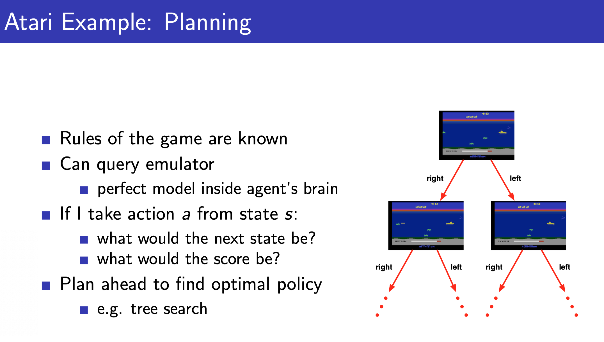

在 plannning 中，环境是已知的，我们被告知了整个环境的运作规则的详细信息。Agent 能够计算出一个完美的模型，并且在不需要与环境进行任何交互的时候进行计算。Agent 不需要实时地与环境交互就能知道未来环境，只需要知道当前的状态，就能够开始思考，来寻找最优解。

在这个游戏中，规则是制定的，我们知道选择 left 之后环境将会产生什么变化。我们完全可以通过已知的变化规则，来在内部进行模拟整个决策过程，无需与环境交互。

一个常用的强化学习问题解决思路是，先学习环境如何工作，也就是了解环境工作的方式，即学习得到一个模型，然后利用这个模型进行规划。

## Exploration and Exploitation


在强化学习里面，`Exploration` 和` Exploitation` 是两个很核心的问题。

* Exploration 是说我们怎么去探索这个环境，通过尝试不同的行为来得到一个最佳的策略，得到最大奖励的策略。

* Exploitation 是说我们不去尝试新的东西，就采取已知的可以得到很大奖励的行为。

因为在刚开始的时候强化学习 agent 不知道它采取了某个行为会发生什么，所以它只能通过试错去探索。所以 Exploration 就是在试错来理解采取的这个行为到底可不可以得到好的奖励。Exploitation 是说我们直接采取已知的可以得到很好奖励的行为。所以这里就面临一个 trade-off，怎么通过牺牲一些短期的 reward 来获得行为的理解。


这里我给大家举一些例子来说明 Exploration 和 Exploitation 的定义。

* 以选择餐馆为例，
  * Exploitation 是说我们直接去你最喜欢的餐馆，因为你去过这个餐馆很多次了，所以你知道这里面的菜都非常可口。
  * Exploration 是说你把手机拿出来，你直接搜索一个新的餐馆，然后去尝试它到底好不好吃。这里的结果就是有可能这个新的餐馆非常不满意，你就这个钱就浪费了。

* 以做广告为例，
  * Exploitation 就是说我们直接采取最优的这个广告策略。
  * Exploration 就是说我们换一种广告方式，然后看这个新的广告策略到底可不可以得到奖励。

* 以挖油为例，
  * Exploitation 就是说我们直接在已知的地方挖油，我们就可以确保挖到油。
  * Exploration 就是说我们在一个新的地方挖油，就有很大的概率，你可能不能发现任何油，但也可能有比较小的概率可以发现一个非常大的油田。
* 以玩游戏为例，
  * Exploitation 就是说你总是采取某一种策略。比如说，你可能打街霸，你采取的策略可能是蹲在角落，然后一直触脚。这个策略很可能可以奏效，但可能遇到特定的对手就失效。
  *  Exploration 就是说你可能尝试一些新的招式，有可能你会发出大招来，这样就可能一招毙命。

### K-armed Bandit
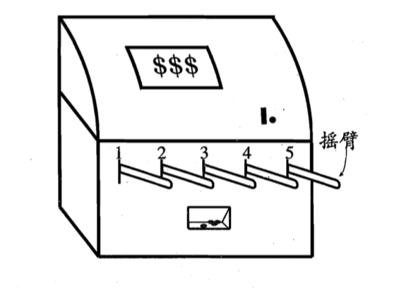

与一般监督学习不同，强化学习任务的最终奖赏是在多步动作之后才能观察到，这里我们不妨先考虑比较简单的情形：最大化单步奖赏，即仅考虑一步操作。需注意的是，即便在这样的简化情形下，强化学习仍与监督学习有显著不同，因为机器需通过尝试来发现各个动作产生的结果，而没有训练数据告诉机器应当做哪个动作。

想要最大化单步奖赏需考虑两个方面：一是需知道每个动作带来的奖赏，二是要执行奖赏最大的动作。若每个动作对应的奖赏是一个确定值，那么尝试遍所有的动作便能找出奖赏最大的动作。然而，更一般的情形是，一个动作的奖赏值是来自于一个概率分布，仅通过一次尝试并不能确切地获得平均奖赏值。

实际上，单步强化学习任务对应了一个理论模型，即` K-臂赌博机(K-armed bandit)`。K-臂赌博机也被称为 `多臂赌博机(Multi-armed bandit) `。如上图所示，K-摇臂赌博机有 K 个摇臂，赌徒在投入一个硬币后可选择按下其中一个摇臂，每个摇臂以一定的概率吐出硬币，但这个概率赌徒并不知道。赌徒的目标是通过一定的策略最大化自己的奖赏，即获得最多的硬币。

* 若仅为获知每个摇臂的期望奖赏，则可采用`仅探索(exploration-only)法`：将所有的尝试机会平均分配给每个摇臂(即轮流按下每个摇臂)，最后以每个摇臂各自的平均吐币概率作为其奖赏期望的近似估计。

* 若仅为执行奖赏最大的动作，则可采用`仅利用(exploitation-only)法`：按下目前最优的(即到目前为止平均奖赏最大的)摇臂，若有多个摇臂同为最优，则从中随机选取一个。

显然，仅探索法能很好地估计每个摇臂的奖赏，却会失去很多选择最优摇臂的机会；仅利用法则相反，它没有很好地估计摇臂期望奖赏，很可能经常选不到最优摇臂。因此，这两种方法都难以使最终的累积奖赏最大化。

事实上，探索(即估计摇臂的优劣)和利用(即选择当前最优摇臂)这两者是矛盾的，因为尝试次数(即总投币数)有限，加强了一方则会自然削弱另一方，这就是强化学习所面临的`探索-利用窘境(Exploration-Exploitation dilemma)`。显然，想要累积奖赏最大，则必须在探索与利用之间达成较好的折中。

## Experiment with Reinforcement Learning
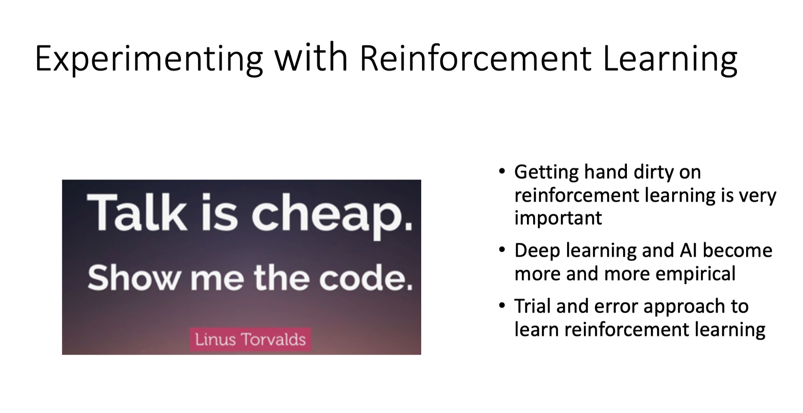
接下来进入一个实践环节。强化学习是一个理论跟实践结合的机器学习分支，需要去推导很多算法公式。然后去理解它算法背后的一些数学原理。另外一方面，上机实践通过实现算法，在很多实验环境里面去探索这个算法是不是可以得到预期效果也是一个非常重要的过程。

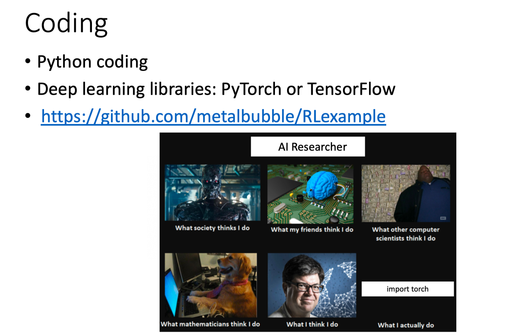

我会在网页上面公布一些代码，会利用 Python 和深度学习的一些包(主要是用 PyTorch 为主)，然后在[这个链接](https://github.com/cuhkrlcourse/RLexample)里面，我其实已经公布了一些 RL 相关的代码。

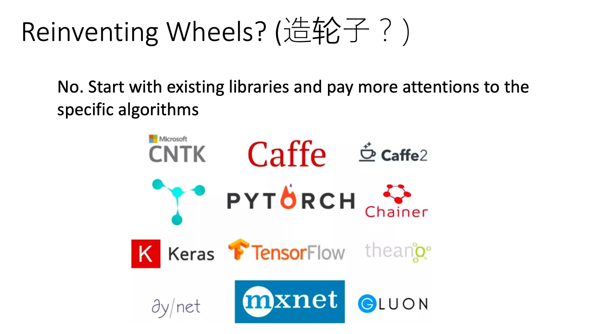

你可以直接调用现有的包来实践。现在有很多深度学习的包可以用，熟练使用这里面的两三种，其实已经可以实现非常多的功能。所以你并不需要从头去去造轮子，就直接调用它里面的函数去实现你想实现的功能。

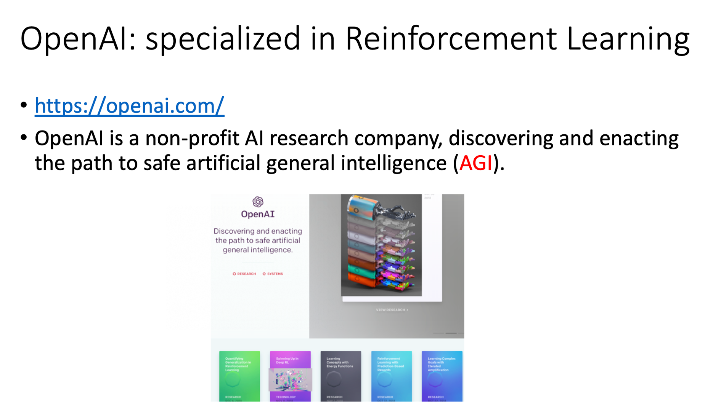

 [ OpenAI](https://openai.com/) 是一个非盈利的人工智能研究公司。Open AI 公布了非常多的学习资源以及这个算法资源，他们之所以叫 Open AI，就是他们把所有开发的算法都 open source 出来。

### Gym

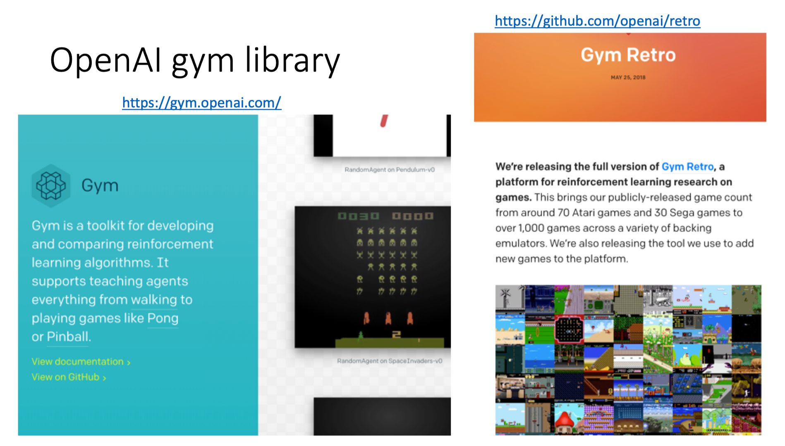

[OpenAI Gym](https://gym.openai.com/) 是一个环境仿真库，里面包含了很多现有的环境。针对不同的场景，我们可以选择不同的环境，

* 离散控制场景(输出的动作是可数的，比如 Pong 游戏中输出的向上或向下动作)：一般使用 Atari 环境评估
* 连续控制场景(输出的动作是不可数的，比如机器人走路时不仅有方向，还要角度，角度就是不可数的，是一个连续的量 )：一般使用 mujoco 环境评估

Gym Retro 是对 Gym 环境的进一步扩展，包含了更多的一些游戏。

我们可以通过 pip 来安装 Gym:

```bash
pip install gym
```

在 Python 环境中导入Gym，如果不报错，就可以认为 Gym 安装成功。

```bash
$python
>>>import gym
```

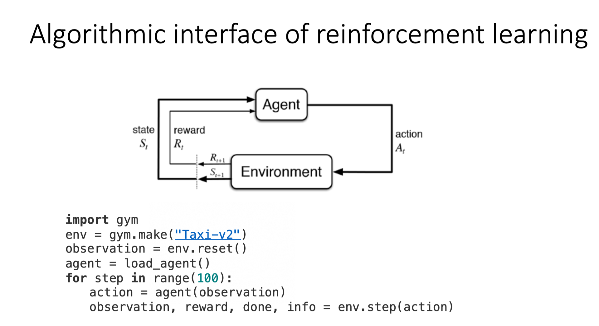

强化学习的这个交互就是由 agent 跟环境进行交互。所以算法的 interface 也是用这个来表示。比如说我们现在安装了 OpenAI Gym。那我们这里就可以直接调入 Taxi-v2 的环境，就建立了这个环境。初始化这个环境过后，就可以进行交互了。Agent 得到这个观测过后，它就会输出一个 action。然后这个 action 会被这个环境拿进去执行这个 step，然后环境就会往前走一步，然后返回新的 observation 和 reward 以及一个 flag variable 就决定你这个游戏是不是结束了。几行代码就实现了强化学习里面的 framework。

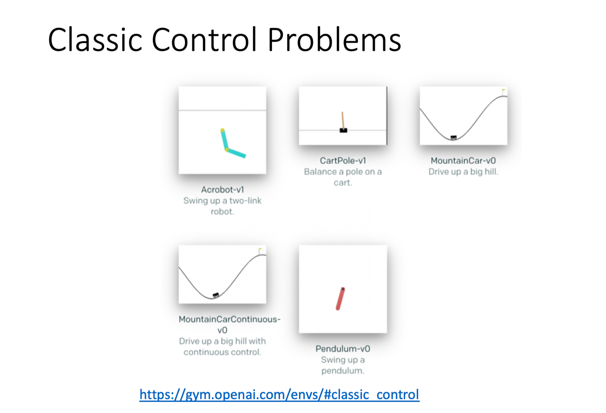
在 OpenAI Gym 里面有很经典的控制类游戏。

* 比如说 Acrobot，就是把这个两节铁杖，然后甩了立起来。
* CartPole 是通过控制一个平板，让这个木棍立起来。
* MountainCar 是通过前后移动这个车，让它到达这个旗子的位置。

大家可以点[这个链接](https://gym.openai.com/envs/#classic_control)看一看这些环境。在刚开始测试强化学习的时候，可以选择这些简单环境，因为这些环境可以在一两分钟之内见到一个效果。

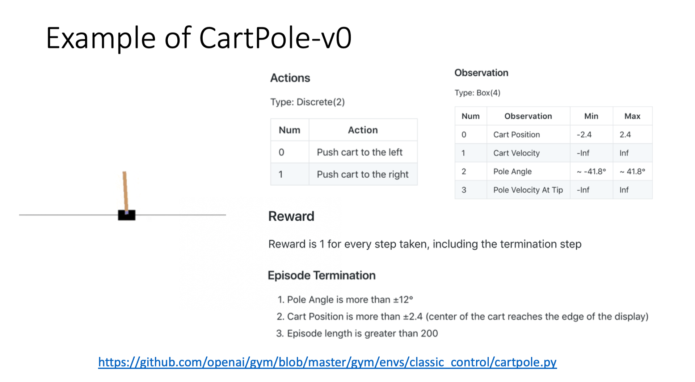

这里我们看一下 CartPole 的这个环境。对于这个环境，有两个动作，Cart 往左移还是往右移。这里得到了观测：这个车当前的位置，Cart 当前的往左往右移的速度，这个杆的角度以及它的杆的最高点的速度。

如果 observation 越详细，就可以更好地描述当前这个所有的状态。这里有 reward 的定义，如果能多保留一步，你就会得到一个奖励，所以你需要在尽可能多的时间存活来得到更多的奖励。当这个杆的角度大于某一个角度（没能保持平衡）或者这个车已经出到外面的时候，游戏就结束了，你就输了。所以这个 agent 的目的就是为了控制木棍，让它尽可能地保持平衡以及尽可能保持在这个环境的中央。

```python
import gym  # 导入 Gym 的 Python 接口环境包
env = gym.make('CartPole-v0')  # 构建实验环境
env.reset()  # 重置一个 episode
for _ in range(1000):
    env.render()  # 显示图形界面
    action = env.action_space.sample() # 从动作空间中随机选取一个动作
    env.step(action) # 用于提交动作，括号内是具体的动作
env.close() # 关闭环境
```

注意：如果绘制了实验的图形界面窗口，那么关闭该窗口的最佳方式是调用`env.close()`。试图直接关闭图形界面窗口可能会导致内存不能释放，甚至会导致死机。

当你执行这段代码时，可能会很失望，因为机器人会完全无视那根本该立起来的杆子，驾驶着小车朝某个方向一通跑，直到不见踪影。这是因为我们还没开始训练机器人。

Gym 中的小游戏，大部分都可以用一个普通的实数或者向量来充当动作。打印 `env.action_space.sample()` 的返回值，能看到输出为 1 或者 0。

`env.action_space.sample()`的含义是，在该游戏的所有动作空间里随机选择一个作为输出。在这个例子中，意思就是，动作只有两个：0 和 1，一左一右。

`env.step()`这个方法的作用不止于此，它还有四个返回值，分别是`observation`、`reward`、`done`、`info`。

* `observation(object)`是状态信息，是在游戏中观测到的屏幕像素值或者盘面状态描述信息。
* `reward(float)`是奖励值，即 action 提交以后能够获得的奖励值。这个奖励值因游戏的不同而不同，但总体原则是，对完成游戏有帮助的动作会获得比较高的奖励值。
* `done(boolean)`表示游戏是否已经完成。如果完成了，就需要重置游戏并开始一个新的Episode。
*  `info(dict)`是一些比较原始的用于诊断和调试的信息，或许对训练有帮助。不过，OpenAI团队在评价你提交的机器人时，是不允许使用这些信息的。

在每个训练中都要使用的返回值有 observation、reward、done。但 observation 的结构会由于游戏的不同而发生变化。以 CartPole-v0 小游戏为例，我们修改下代码：

```python
import gym  
env = gym.make('CartPole-v0')  
env.reset()  
for _ in range(1000):
    env.render()  
    action = env.action_space.sample() 
    observation, reward, done, info = env.step(action)
    print(observation)
env.close()
```

输出：

```
[ 0.01653398  0.19114579  0.02013859 -0.28050058]
[ 0.0203569  -0.00425755  0.01452858  0.01846535]
[ 0.02027175 -0.19958481  0.01489789  0.31569658]
......
```

从输出可以看出这是一个四维的 Observation。在其他游戏中会有维度很多的情况。

`env.step()`完成了一个完整的 $S \to A \to R \to S'$ 过程。我们只要不断观测这样的过程，并让机器在其中用相应的算法完成训练，就能得到一个高质量的强化学习模型。

想要查看当前 Gym 库已经注册了哪些环境，可以使用以下代码：

```python
from gym import envs
env_specs = envs.registry.all()
envs_ids = [env_spec.id for env_spec in env_specs]
print(envs_ids)
```

每个环境都定义了自己的观测空间和动作空间。环境 env 的观测空间用`env.observation_space`表示，动作空间用 `env.action_space `表示。观测空间和动作空间既可以是离散空间（即取值是有限个离散的值），也可以是连续空间（即取值是连续的）。在 Gym 库中，离散空间一般用`gym.spaces.Discrete`类表示，连续空间用`gym.spaces.Box`类表示。

例如，环境`'MountainCar-v0'`的观测空间是`Box(2,)`，表示观测可以用  2  个 float 值表示；环境`'MountainCar-v0'`的动作空间是`Dicrete(3)`，表示动作取值自`{0,1,2}`。对于离散空间，`gym.spaces.Discrete`类实例的成员 n 表示有几个可能的取值；对于连续空间，`Box`类实例的成员 low 和 high 表示每个浮点数的取值范围。

### MountainCar-v0 Example

接下来，我们通过一个例子来学习如何与 Gym 库进行交互。我们选取 `小车上山(MountainCar-v0)`作为例子。

首先我们来看看这个任务的观测空间和动作空间：

```python
import gym
env = gym.make('MountainCar-v0')
print('观测空间 = {}'.format(env.observation_space))
print('动作空间 = {}'.format(env.action_space))
print('观测范围 = {} ~ {}'.format(env.observation_space.low,
        env.observation_space.high))
print('动作数 = {}'.format(env.action_space.n))
```

输出：

```
观测空间 = Box(2,)
动作空间 = Discrete(3)
观测范围 = [-1.2  -0.07] ~ [0.6  0.07]
动作数 = 3
```

由输出可知，观测空间是形状为 (2,) 的浮点型 np.array，动作空间是取 {0,1,2} 的 int 型数值。

接下来考虑智能体。智能体往往是我们自己实现的。我们可以实现一个智能体类：`BespokeAgent类`，代码如下所示：

```python
class BespokeAgent:
    def __init__(self, env):
        pass
    
    def decide(self, observation): # 决策
        position, velocity = observation
        lb = min(-0.09 * (position + 0.25) ** 2 + 0.03,
                0.3 * (position + 0.9) ** 4 - 0.008)
        ub = -0.07 * (position + 0.38) ** 2 + 0.07
        if lb < velocity < ub:
            action = 2
        else:
            action = 0
        return action # 返回动作

    def learn(self, *args): # 学习
        pass
    
agent = BespokeAgent(env)
```

智能体的 `decide()` 方法实现了决策功能，而 `learn()` 方法实现了学习功能。`BespokeAgent`类是一个比较简单的类，它只能根据给定的数学表达式进行决策，并且不能有效学习。所以它并不是一个真正意义上的强化学习智能体类。但是，用于演示智能体和环境的交互已经足够了。

接下来我们试图让智能体与环境交互，代码如下所示：

```python
def play_montecarlo(env, agent, render=False, train=False):
    episode_reward = 0. # 记录回合总奖励，初始化为0
    observation = env.reset() # 重置游戏环境，开始新回合
    while True: # 不断循环，直到回合结束
        if render: # 判断是否显示
            env.render() # 显示图形界面，图形界面可以用 env.close() 语句关闭
        action = agent.decide(observation)
        next_observation, reward, done, _ = env.step(action) # 执行动作
        episode_reward += reward # 收集回合奖励
        if train: # 判断是否训练智能体
            agent.learn(observation, action, reward, done) # 学习
        if done: # 回合结束，跳出循环
            break
        observation = next_observation
    return episode_reward # 返回回合总奖励
```

上面代码中的 `play_montecarlo`  函数可以让智能体和环境交互一个回合。这个函数有 4 个参数：

* `env` 是环境类
* `agent` 是智能体类
*  `render`是 bool 类型变量，指示在运行过程中是否要图形化显示。如果函数参数 render为 True，那么在交互过程中会调用 `env.render()` 以显示图形化界面，而这个界面可以通过调用 `env.close()` 关闭。
* `train`是 bool 类型的变量，指示在运行过程中是否训练智能体。在训练过程中应当设置为 True，以调用 `agent.learn()` 函数；在测试过程中应当设置为 False，使得智能体不变。

这个函数有一个返回值 `episode_reward`，是 float 类型的数值，表示智能体与环境交互一个回合的回合总奖励。

接下来，我们使用下列代码让智能体和环境交互一个回合，并在交互过程中图形化显示，可用 `env.close()` 语句关闭图形化界面。

```python
env.seed(0) # 设置随机数种子,只是为了让结果可以精确复现,一般情况下可删去
episode_reward = play_montecarlo(env, agent, render=True)
print('回合奖励 = {}'.format(episode_reward))
env.close() # 此语句可关闭图形界面
```

输出：

```
回合奖励 = -105.0
```

为了系统评估智能体的性能，下列代码求出了连续交互 100 回合的平均回合奖励。

```python
episode_rewards = [play_montecarlo(env, agent) for _ in range(100)]
print('平均回合奖励 = {}'.format(np.mean(episode_rewards)))
```

输出：

```
平均回合奖励 = -102.61
```

小车上山环境有一个参考的回合奖励值 -110，如果当连续 100 个回合的平均回合奖励大于 -110，则认为这个任务被解决了。`BespokeAgent` 类对应的策略的平均回合奖励大概就在 -110 左右。

测试 agent 在 Gym 库中某个任务的性能时，学术界一般最关心 100 个回合的平均回合奖励。至于为什么是 100 个回合而不是其他回合数（比如 128 个回合），完全是习惯使然，没有什么特别的原因。对于有些环境，还会指定一个参考的回合奖励值，当连续 100 个回合的奖励大于指定的值时，就认为这个任务被解决了。但是，并不是所有的任务都指定了这样的值。对于没有指定值的任务，就无所谓任务被解决了或者没有被解决。

总结一下 Gym 的用法：使用 `env=gym.make(环境名)` 取出环境，使用 `env.reset()`初始化环境，使用`env.step(动作)`执行一步环境，使用 `env.render()`显示环境，使用 `env.close()` 关闭环境。

最后提一下，Gym 有对应的[官方文档](https://gym.openai.com/docs/)，大家可以阅读文档来学习 Gym。

##  References

* [百面深度学习](https://book.douban.com/subject/35043939/)
* [强化学习：原理与Python实现](https://book.douban.com/subject/34478302/)
* [白话强化学习与PyTorch](https://book.douban.com/subject/34809676/)
* [OpenAI Spinning Up ](https://spinningup.openai.com/en/latest/spinningup/rl_intro.html#)
* [神经网络与深度学习](https://nndl.github.io/)
* [机器学习](https://book.douban.com/subject/26708119//)
* [强化学习基础 David Silver 笔记](https://zhuanlan.zhihu.com/c_135909947)
* [David Silver 强化学习公开课中文讲解及实践](https://zhuanlan.zhihu.com/reinforce)
* [UCL Course on RL(David Silver)](https://www.davidsilver.uk/teaching/)


