# Tabular Methods

本章我们通过最简单的`表格型的方法(tabular methods)`来讲解如何使用 value-based 方法去求解强化学习。

## MDP

**强化学习的三个重要的要素：状态、动作和奖励。**强化学习智能体跟环境是一步一步交互的，就是我先观察一下状态，然后再输入动作。再观察一下状态，再输出动作，拿到这些 reward 。它是一个跟时间相关的序列决策的问题。

举个例子，在 $t-1$ 时刻，我看到了熊对我招手，那我下意识的可能输出的动作就是赶紧跑路。熊看到了有人跑了，可能就觉得发现猎物，开始发动攻击。而在 $t$ 时刻的话，我如果选择装死的动作，可能熊咬了咬我，摔了几下就发现就觉得挺无趣的，可能会走开。这个时候，我再跑路的话可能就跑路成功了，就是这样子的一个序列决策的过程。

当然在输出每一个动作之前，你可以选择不同的动作。比如说在 $t$ 时刻，我选择跑路的时候，熊已经追上来了，如果说 $t$ 时刻，我没有选择装死，而我是选择跑路的话，这个时候熊已经追上了，那这个时候，其实我有两种情况转移到不同的状态去，就我有一定的概率可以逃跑成功，也有很大的概率我会逃跑失败。那我们就用状态转移概率 $p\left[s_{t+1}, r_{t} \mid s_{t}, a_{t}\right]$ 来表述说在 $s_t$ 的状态选择了 $a_t$ 的动作的时候，转移到 $s_{t+1}$ ，而且拿到  $r_t$ 的概率是多少。

这样子的一个状态转移概率是具有`马尔可夫性质`的(系统下一时刻的状态仅由当前时刻的状态决定，不依赖于以往任何状态)。因为这个状态转移概率，它是下一时刻的状态是取决于当前的状态，它和之前的 $s_{t-1}$ 和 $s_{t-2}$  都没有什么关系。然后再加上这个过程也取决于智能体跟环境交互的这个 $a_t$ ，所以有一个决策的一个过程在里面。我们就称这样的一个过程为`马尔可夫决策过程(Markov Decision Process, MDP)`。

MDP 就是序列决策这样一个经典的表达方式。MDP 也是强化学习里面一个非常基本的学习框架。状态、动作、状态转移概率和奖励 $(S,A,P,R)$，这四个合集就构成了强化学习 MDP 的四元组，后面也可能会再加个衰减因子构成五元组。

### Model-based

如上图所示，我们把这些可能的动作和可能的状态转移的关系画成一个树状图。它们之间的关系就是从 $s_t$ 到 $a_t$ ，再到 $s_{t+1}$ ，再到 $a_{t+1}$，再到 $s_{t+2}$ 这样子的一个过程。

我们去跟环境交互，只能走完整的一条通路。这里面产生了一系列的一个决策的过程，就是我们跟环境交互产生了一个经验。**我们会使用 `P 函数(probability function)`和 `R 函数(reward function)`来去描述环境。**P 函数就是状态转移的概率，P 函数实际上反映的是环境的一个随机性。

**当我们知道 P 函数和  R 函数时，我们就说这个 MDP 是已知的，可以通过 policy iteration 和 value iteration 来找最佳的策略。**

比如，在熊发怒的情况下，我如果选择装死，假设熊看到人装死就一定会走的话，我们就称在这里面的状态转移概率就是 100%。但如果说在熊发怒的情况下，我选择跑路而导致可能跑成功以及跑失败，出现这两种情况。那我们就可以用概率去表达一下说转移到其中一种情况的概率大概 10%，另外一种情况的概率大概是 90% 会跑失败。

**如果知道这些状态转移概率和奖励函数的话，我们就说这个环境是已知的，因为我们是用这两个函数去描述环境的。**如果是已知的话，我们其实可以用动态规划去计算说，如果要逃脱熊，那么能够逃脱熊概率最大的最优策略是什么。很多强化学习的经典算法都是 model-free 的，就是环境是未知的。

### Model-free

因为现实世界中人类第一次遇到熊之前，我们根本不知道能不能跑得过熊，所以刚刚那个 10%、90% 的概率也就是虚构出来的概率。熊到底在什么时候会往什么方向去转变的话，我们经常是不知道的。

**我们是处在一个未知的环境里的，也就是这一系列的决策的 P 函数和 R 函数是未知的，这就是 model-based 跟 model-free 的一个最大的区别。**

强化学习就是可以用来解决用完全未知的和随机的环境。强化学习要像人类一样去学习，人类学习的话就是一条路一条路地去尝试一下，先走一条路，看看结果到底是什么。多试几次，只要能活命的。我们可以慢慢地了解哪个状态会更好，

* 我们用价值函数 $V(s)$ 来代表这个状态是好的还是坏的。
* 用 Q 函数来判断说在什么状态下做什么动作能够拿到最大奖励，用 Q 函数来表示这个状态-动作值。

### Model-based vs. Model-free

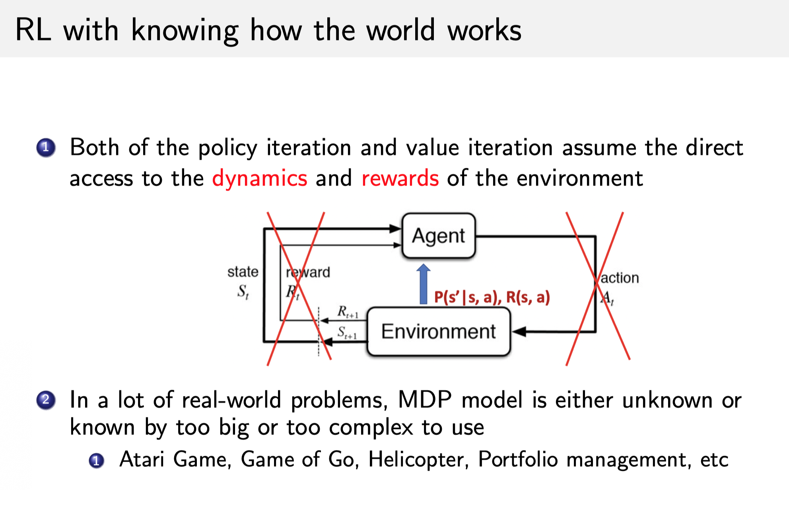

* Policy iteration 和 value iteration 都需要得到环境的转移和奖励函数，所以在这个过程中，agent 没有跟环境进行交互。
* 在很多实际的问题中，MDP 的模型有可能是未知的，也有可能模型太大了，不能进行迭代的计算。比如 Atari 游戏、围棋、控制直升飞机、股票交易等问题，这些问题的状态转移太复杂了。

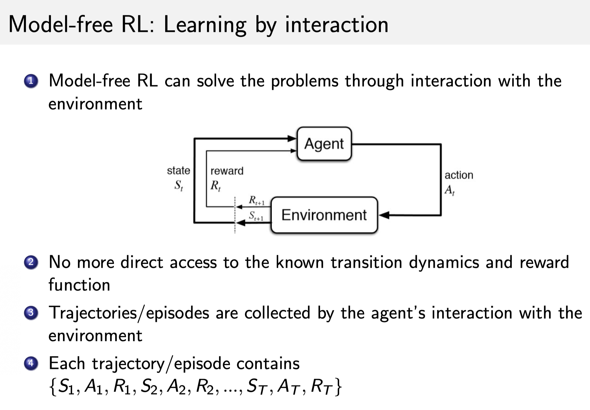

* 在这种情况下，我们使用 model-free 强化学习的方法来解。 
* Model-free 没有获取环境的状态转移和奖励函数，我们让 agent 跟环境进行交互，采集到很多的轨迹数据，agent 从轨迹中获取信息来改进策略，从而获得更多的奖励。

## Q-table

接下来介绍下 Q 函数。在多次尝试和熊打交道之后，人类就可以对熊的不同的状态去做出判断，我们可以用状态动作价值来表达说在某个状态下，为什么动作 1 会比动作 2 好，因为动作 1 的价值比动作 2 要高，这个价值就叫 `Q 函数`。

**如果 `Q 表格`是一张已经训练好的表格的话，那这一张表格就像是一本生活手册。**我们就知道在熊发怒的时候，装死的价值会高一点。在熊离开的时候，我们可能偷偷逃跑的会比较容易获救。

这张表格里面 Q 函数的意义就是我选择了这个动作之后，最后面能不能成功，就是我需要去计算在这个状态下，我选择了这个动作，后续能够一共拿到多少总收益。如果可以预估未来的总收益的大小，我们当然知道在当前的这个状态下选择哪个动作，价值更高。我选择某个动作是因为我未来可以拿到的那个价值会更高一点。所以强化学习的目标导向性很强，环境给出的 reward 是一个非常重要的反馈，它就是根据环境的 reward 来去做选择。

Q: 为什么可以用未来的总收益来评价当前这个动作是好是坏?

A: 举个例子，假设一辆车在路上，当前是红灯，我们直接走的收益就很低，因为违反交通规则，这就是当前的单步收益。可是如果我们这是一辆救护车，我们正在运送病人，把病人快速送达医院的收益非常的高，而且越快你的收益越大。在这种情况下，我们很可能应该要闯红灯，因为未来的远期收益太高了。这也是为什么强化学习需要去学习远期的收益，因为在现实世界中奖励往往是延迟的，是有 delay 的。所以我们一般会从当前状态开始，把后续有可能会收到所有收益加起来计算当前动作的 Q 的价值，让 Q 的价值可以真正地代表当前这个状态下，动作的真正的价值。

但有的时候把目光放得太长远不好，因为如果事情很快就结束的话，你考虑到最后一步的收益无可厚非。如果是一个持续的没有尽头的任务，即`持续式任务(Continuing Task)`，你把未来的收益全部相加，作为当前的状态价值就很不合理。

股票的例子就很典型了，我们要关注的是累积的收益。可是如果说十年之后才有一次大涨大跌，你显然不会把十年后的收益也作为当前动作的考虑因素。那我们会怎么办呢，有句俗话说得好，对远一点的东西，我们就当做近视，就不需要看得太清楚，我们可以引入这个衰减因子 $\gamma$ 来去计算这个未来总收益，$\gamma \in [0,1]$，越往后 $\gamma^n$ 就会越小，也就是说越后面的收益对当前价值的影响就会越小。

举个例子来看看计算出来的是什么效果。这是一个悬崖问题，这个问题是需要智能体从出发点 S 出发，到达目的地 G，同时避免掉进悬崖(cliff)，掉进悬崖的话就会有 -100 分的惩罚，但游戏不会结束，它会被直接拖回起点，游戏继续。为了到达目的地，我们可以沿着蓝线和红线走。

在这个环境当中，我们怎么去计算状态动作价值(未来的总收益)。

* 如果 $\gamma = 0$， 假设我走一条路，并从这个状态出发，在这里选择是向上，这里选择向右。如果 $\gamma = 0$，用这个公式去计算的话，它相当于考虑的就是一个单步的收益。我们可以认为它是一个目光短浅的计算的方法。

* 如果 $\gamma = 1$，那就等于是说把后续所有的收益都全部加起来。在这里悬崖问题，你每走一步都会拿到一个 -1 分的 reward，只有到了终点之后，它才会停止。如果 $\gamma =1 $ 的话，我们用这个公式去计算，就这里是 -1。然后这里的话，未来的总收益就是 $-1+-1=-2$ 。 

* 如果 $\gamma = 0.6$，就是目光没有放得那么的长远，计算出来是这个样子的。利用 $G_{t}=R_{t+1}+\gamma G_{t+1}$ 这个公式从后往前推。

$$
\begin{array}{l}
G_{7}=R+\gamma G_{8}=-1+0.6 *(-2.176)=-2.3056 \approx-2.3 \\
G_{8}=R+\gamma G_{9}=-1+0.6 *(-1.96)=-2.176 \approx-2.18 \\
G_{9}=R+\gamma G_{10}=-1+0.6 *(-1.6)=-1.96 \\
G_{10}=R+\gamma G_{11}=-1+0.6 *(-1)=-1.6 \\
G_{12}=R+\gamma G_{13}=-1+0.6 * 0=-1 \\
G_{13}=0
\end{array}
$$

这里的计算是我们选择了一条路，计算出这条路径上每一个状态动作的价值。我们可以看一下右下角这个图，如果说我走的不是红色的路，而是蓝色的路，那我算出来的 Q 值可能是这样。那我们就知道，当小乌龟在 -12 这个点的时候，往右边走是 -11，往上走是 -15，它自然就知道往右走的价值更大，小乌龟就会往右走。

类似于上图，最后我们要求解的就是一张 Q 表格，

* 它的行数是所有的状态数量，一般可以用坐标来表示表示格子的状态，也可以用 1、2、3、4、5、6、7 来表示不同的位置。
* Q 表格的列表示上下左右四个动作。

最开始这张 Q 表格会全部初始化为零，然后 agent 会不断地去和环境交互得到不同的轨迹，当交互的次数足够多的时候，我们就可以估算出每一个状态下，每个行动的平均总收益去更新这个 Q  表格。怎么去更新 Q 表格就是接下来要引入的强化概念。

**`强化`就是我们可以用下一个状态的价值来更新当前状态的价值，其实就是强化学习里面 bootstrapping 的概念。**在强化学习里面，你可以每走一步更新一下 Q 表格，然后用下一个状态的 Q 值来更新这个状态的 Q 值，这种单步更新的方法叫做`时序差分`。

## Model-free Prediction

在没法获取 MDP 的模型情况下，我们可以通过以下两种方法来估计某个给定策略的价值：

* Monte Carlo policy evaluation
* Temporal Difference(TD) learning

### Monte-Carlo Policy Evaluation

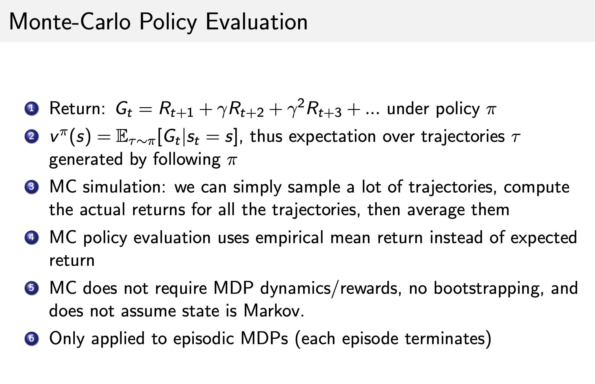

* `蒙特卡罗(Monte-Carlo，MC)`方法是基于采样的方法，我们让 agent 跟环境进行交互，就会得到很多轨迹。每个轨迹都有对应的 return：

$$
G_{t}=R_{t+1}+\gamma R_{t+2}+\gamma^{2} R_{t+3}+\ldots
$$

* 我们把每个轨迹的 return 进行平均，就可以知道某一个策略下面对应状态的价值。

* MC 是用 `empirical mean` return 的方法来估计。

* MC 方法不需要 MDP 的转移函数和奖励函数，并且不需要像动态规划那样用 bootstrapping  的方法。

* MC 的局限性：只能用在有终止的 MDP 。

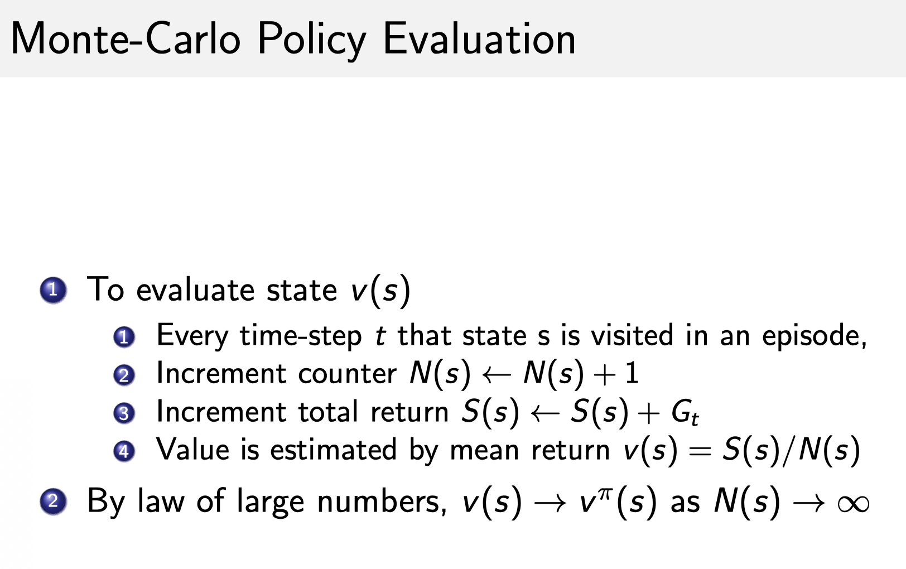

* 上图是 MC 算法的概括。
* 为了得到评估 $v(s)$，我们进行了如下的步骤：
  * 在每个 episode 中，如果在时间步 t 状态 s 被访问了，那么
    * 状态 s 的访问数 $N(s)$ 增加 1，
    * 状态 s 的总的回报 $S(s)$  增加 $G_t$。
  * 状态 s 的价值可以通过 return 的平均来估计，即 $v(s)=S(s)/N(s)$。

* 根据大数定律，只要我们得到足够多的轨迹，就可以趋近这个策略对应的价值函数。

假设现在有样本 $x_1,x_2,\cdots$，我们可以把 empirical mean 转换成 `incremental mean` 的形式，如下式所示：
$$
\begin{aligned}
\mu_{t} &=\frac{1}{t} \sum_{j=1}^{t} x_{j} \\
&=\frac{1}{t}\left(x_{t}+\sum_{j=1}^{t-1} x_{j}\right) \\
&=\frac{1}{t}\left(x_{t}+(t-1) \mu_{t-1}\right) \\
&=\frac{1}{t}\left(x_{t}+t \mu_{t-1}-\mu_{t-1}\right) \\
&=\mu_{t-1}+\frac{1}{t}\left(x_{t}-\mu_{t-1}\right) 
\end{aligned}
$$
通过这种转换，我们就可以把上一时刻的平均值跟现在时刻的平均值建立联系，即：
$$
\mu_t = \mu_{t-1}+\frac{1}{t}(x_t-\mu_{t-1})
$$
其中：

* $x_t- \mu_{t-1}$ 是残差
* $\frac{1}{t}$ 类似于 learning rate

当我们得到 $x_t$，就可以用上一时刻的值来更新现在的值。

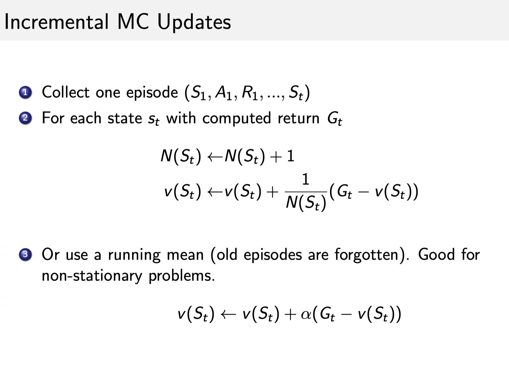

我们可以把 Monte-Carlo 更新的方法写成 incremental MC 的方法：

* 我们采集数据，得到一个新的轨迹。
* 对于这个轨迹，我们采用增量的方法进行更新，如下式所示：

$$
\begin{array}{l}
N\left(S_{t}\right) \leftarrow N\left(S_{t}\right)+1 \\
v\left(S_{t}\right) \leftarrow v\left(S_{t}\right)+\frac{1}{N\left(S_{t}\right)}\left(G_{t}-v\left(S_{t}\right)\right)
\end{array}
$$

* 我们可以直接把 $\frac{1}{N(S_t)}$ 变成 $\alpha$ (学习率)，$\alpha$ 代表着更新的速率有多快，我们可以进行设置。

**我们再来看一下 DP 和 MC 方法的差异。**

* 动态规划也是常用的估计价值函数的方法。在动态规划里面，我们使用了 bootstrapping 的思想。bootstrapping 的意思就是我们基于之前估计的量来估计一个量。

* DP 就是用 Bellman expectation backup，就是通过上一时刻的值 $v_{i-1}(s')$ 来更新当前时刻 $v_i(s)$ 这个值，不停迭代，最后可以收敛。Bellman expectation backup 就有两层加和，内部加和和外部加和，算了两次 expectation，得到了一个更新。

MC 是通过 empirical mean return （实际得到的收益）来更新它，对应树上面蓝色的轨迹，我们得到是一个实际的轨迹，实际的轨迹上的状态已经是决定的，采取的行为都是决定的。MC 得到的是一条轨迹，这条轨迹表现出来就是这个蓝色的从起始到最后终止状态的轨迹。现在只是更新这个轨迹上的所有状态，跟这个轨迹没有关系的状态都没有更新。

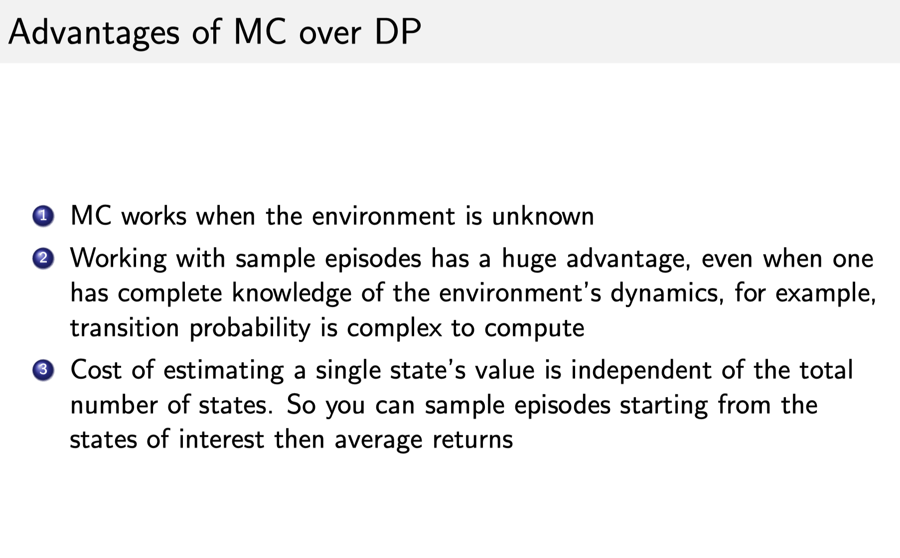

* MC 可以在不知道环境的情况下 work，而 DP 是 model-based。
* MC 只需要更新一条轨迹的状态，而 DP 则是需要更新所有的状态。状态数量很多的时候（比如一百万个，两百万个），DP 这样去迭代的话，速度是非常慢的。这也是 sample-based 的方法 MC 相对于 DP 的优势。

### Temporal Difference

**为了让大家更好地理解`时序差分(Temporal Difference,TD)`这种更新方法，这边给出它的物理意义。**我们先理解一下巴普洛夫的条件反射实验，这个实验讲的是小狗会对盆里面的食物无条件产生刺激，分泌唾液。一开始小狗对于铃声这种中性刺激是没有反应的，可是我们把这个铃声和食物结合起来，每次先给它响一下铃，再给它喂食物，多次重复之后，当铃声响起的时候，小狗也会开始流口水。盆里的肉可以认为是强化学习里面那个延迟的 reward，声音的刺激可以认为是有 reward 的那个状态之前的一个状态。多次重复实验之后，最后的这个 reward 会强化小狗对于这个声音的条件反射，它会让小狗知道这个声音代表着有食物，这个声音对于小狗来说也就有了价值，它听到这个声音也会流口水。

巴普洛夫效应揭示的是中性刺激(铃声)跟无条件刺激(食物)紧紧挨着反复出现的时候，条件刺激也可以引起无条件刺激引起的唾液分泌，然后形成这个条件刺激。

**这种中性刺激跟无条件刺激在时间上面的结合，我们就称之为强化。** 强化的次数越多，条件反射就会越巩固。小狗本来不觉得铃声有价值的，经过强化之后，小狗就会慢慢地意识到铃声也是有价值的，它可能带来食物。更重要是一种条件反射巩固之后，我们再用另外一种新的刺激和条件反射去结合，还可以形成第二级条件反射，同样地还可以形成第三级条件反射。

在人的身上是可以建立多级的条件反射的，举个例子，比如说一般我们遇到熊都是这样一个顺序：看到树上有熊爪，然后看到熊之后，突然熊发怒，扑过来了。经历这个过程之后，我们可能最开始看到熊才会瑟瑟发抖，后面就是看到树上有熊爪就已经有害怕的感觉了。也就说在不断的重复试验之后，下一个状态的价值，它是可以不断地去强化影响上一个状态的价值的。

**为了让大家更加直观感受下一个状态影响上一个状态**，我们推荐这个网站：[Temporal Difference Learning Gridworld Demo](https://cs.stanford.edu/people/karpathy/reinforcejs/gridworld_td.html)。

* 我们先初始化一下，然后开始时序差分的更新过程。
* 在训练的过程中，你会看到这个小黄球在不断地试错，在探索当中会先迅速地发现有 reward 的地方。最开始的时候，只是这些有 reward 的格子才有价值。当不断地重复走这些路线的时候，这些有价值的格子可以去慢慢地影响它附近的格子的价值。
* 反复训练之后，这些有 reward 的格子周围的格子的状态就会慢慢地被强化。强化就是当它收敛到最后一个最优的状态了，这些价值最终收敛到一个最优的情况之后，那个小黄球就会自动地知道，就是我一直往价值高的地方走，就能够走到能够拿到 reward 的地方。

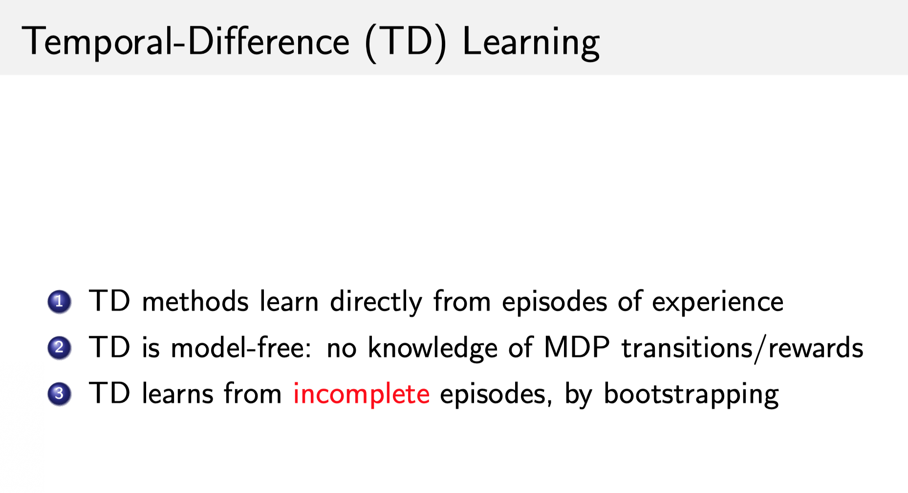

* TD 是介于 MC 和 DP 之间的方法。

* TD 是 model free 的，不需要 MDP 的转移矩阵和奖励函数。
* TD 可以从不完整的 episode 中学习，结合了 bootstrapping 的思想。

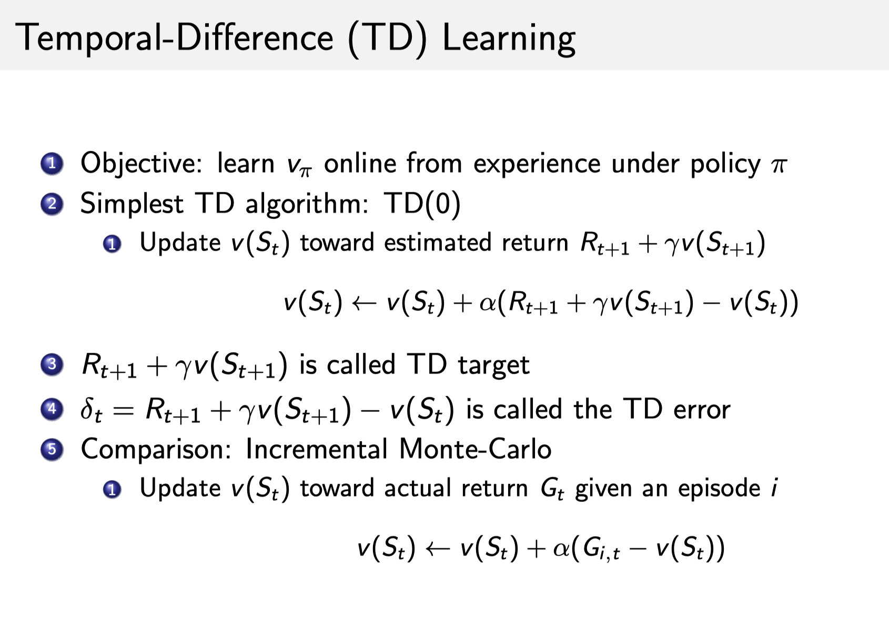

* 上图是 TD 算法的框架。
* 目的：对于某个给定的策略，在线(online)地算出它的价值函数，即一步一步地(step-by-step)算。
* 最简单的算法是 `TD(0)`，每往前走一步，就做一步 bootstrapping，用得到的 estimated return 来更新上一时刻的值 
* Estimated return $R_{t+1}+\gamma v(S_{t+1})$ 被称为 `TD target`，TD target 是带衰减的未来收益的总和。TD target 由两部分组成：
  * 走了某一步后得到的实际奖励：$R_{t+1}$， 
  * 我们利用了 bootstrapping 的方法，通过之前的估计来估计 $v(S_{t+1})$  ，然后加了一个折扣系数，即 $\gamma v(S_{t+1})$。
* `TD error` $\delta=R_{t+1}+\gamma v(S_{t+1})-v(S_t)$。
* 可以类比于 Incremental Monte-Carlo 的方法，写出如下的更新方法：

$$
v\left(S_{t}\right) \leftarrow v\left(S_{t}\right)+\alpha\left(R_{t+1}+\gamma v\left(S_{t+1}\right)-v\left(S_{t}\right)\right)
$$

> 上式体现了强化这个概念。

* 我们对比下 MC 和 TD：
  * 在 MC 里面 $G_{i,t}$ 是实际得到的值（可以看成 target），因为它已经把一条轨迹跑完了，可以算每个状态实际的 return。
  * TD 没有等轨迹结束，往前走了一步，就可以更新价值函数。 

* TD 只执行了一步，状态的值就更新。

* MC 全部走完了之后，到了终止状态之后，再更新它的值。

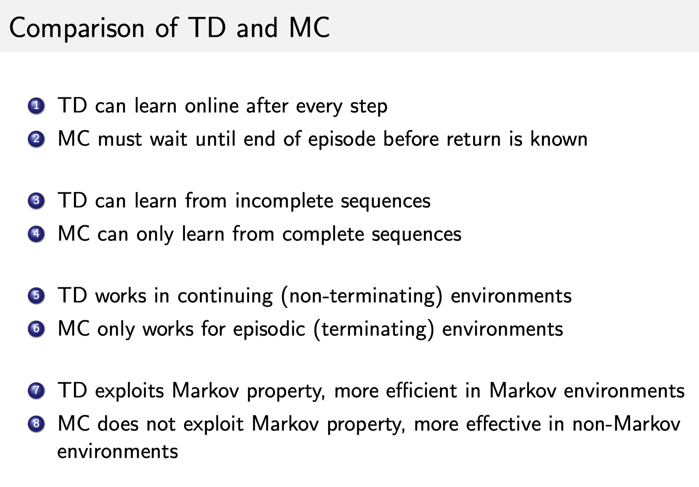

* TD 可以 online learning，每走一步就可以更新，效率高。
* MC 必须等游戏结束才可以学习。

*  TD 可以从不完整序列上进行学习。
* TD 只能从完整的序列上进行学习。

* TD 可以在连续的环境下（没有终止）进行学习。
* MC 只能在有终止的情况下学习。

* TD 利用了马尔可夫性质，在马尔可夫环境下有更高的学习效率。
* MC 没有假设环境具有马尔可夫性质，利用采样的价值来估计某一个状态的价值，在不是马尔可夫的环境下更加有效

**举个例子来解释 TD 和 MC 的区别，**

* TD 是指在不清楚马尔可夫状态转移概率的情况下，以采样的方式得到不完整的状态序列，估计某状态在该状态序列完整后可能得到的收益，并通过不断地采样持续更新价值。
* MC 则需要经历完整的状态序列后，再来更新状态的真实价值。

例如，你想获得开车去公司的时间，每天上班开车的经历就是一次采样。假设今天在路口 A 遇到了堵车，

* TD 会在路口 A 就开始更新预计到达路口 B、路口 C $\cdots \cdots$，以及到达公司的时间；
* 而 MC 并不会立即更新时间，而是在到达公司后，再修改到达每个路口和公司的时间。

**TD 能够在知道结果之前就开始学习，相比 MC，其更快速、灵活。**

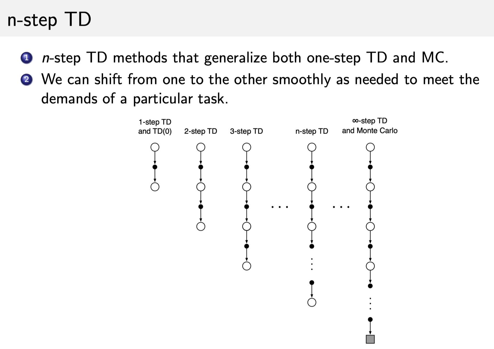

* 我们可以把 TD 进行进一步的推广。之前是只往前走一步，即 one-step TD，TD(0)。

* 我们可以调整步数，变成 `n-step TD`。比如 `TD(2)`，即往前走两步，然后利用两步得到的 return，使用 bootstrapping 来更新状态的价值。

* 这样就可以通过 step 来调整这个算法需要多少的实际奖励和 bootstrapping。

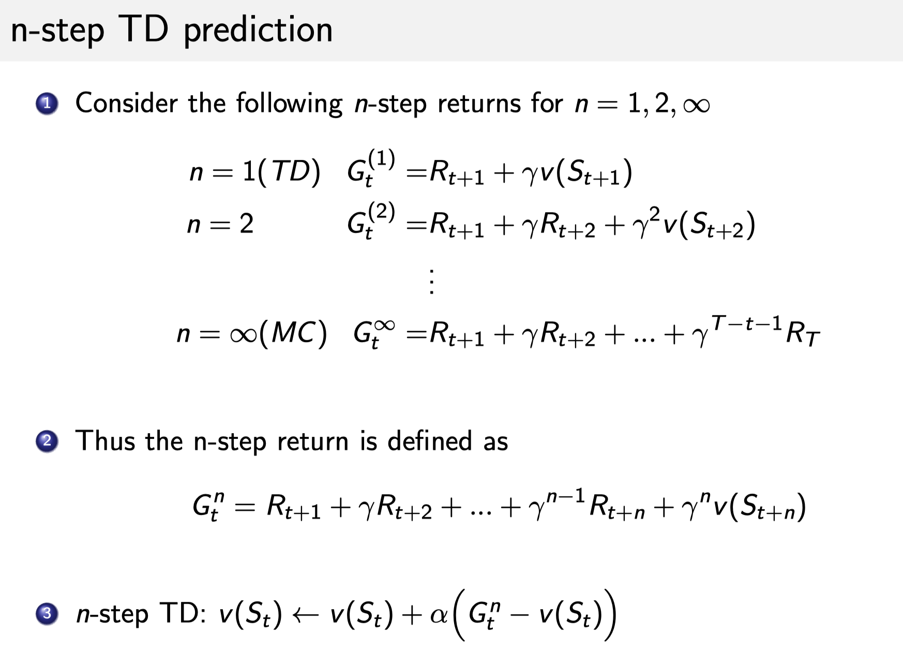

* 通过调整步数，可以进行一个 MC 和 TD 之间的 trade-off，如果 $n=\infty$， 即整个游戏结束过后，再进行更新，TD 就变成了 MC。
* n-step 的 TD target 如下式所示：

$$
G_{t}^{n}=R_{t+1}+\gamma R_{t+2}+\ldots+\gamma^{n-1} R_{t+n}+\gamma^{n} v\left(S_{t+n}\right)
$$

* 得到 TD target 之后，我们用 incremental learning 的方法来更新状态的价值：

$$
v\left(S_{t}\right) \leftarrow v\left(S_{t}\right)+\alpha\left(G_{t}^{n}-v\left(S_{t}\right)\right)
$$

### Bootstrapping and Sampling for DP,MC and TD

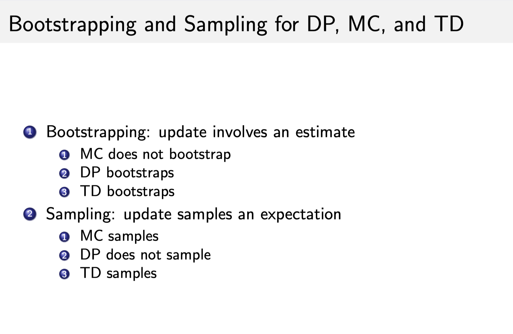

* Bootstrapping：更新时使用了估计：
  * MC 没用 bootstrapping，因为它是根据实际的 return 来更新。
  * DP 用了 bootstrapping。
  * TD 用了 bootstrapping。

* Sampling：更新时通过采样得到一个期望：
  * MC 是纯 sampling 的方法。
  * DP 没有用 sampling，它是直接用 Bellman expectation equation 来更新状态价值的。
  * TD 用了 sampling。TD target 由两部分组成，一部分是 sampling，一部分是 bootstrapping。

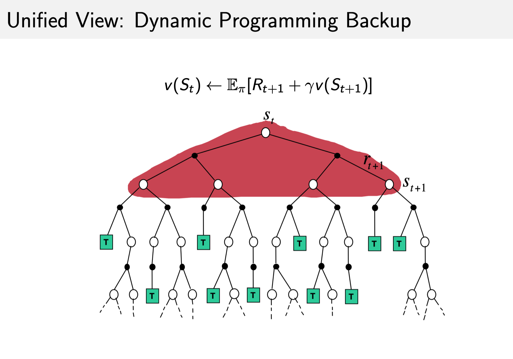

DP 是直接算 expectation，把它所有相关的状态都进行加和。

MC 在当前状态下，采一个支路，在一个path 上进行更新，更新这个 path 上的所有状态。

TD 是从当前状态开始，往前走了一步，关注的是非常局部的步骤。

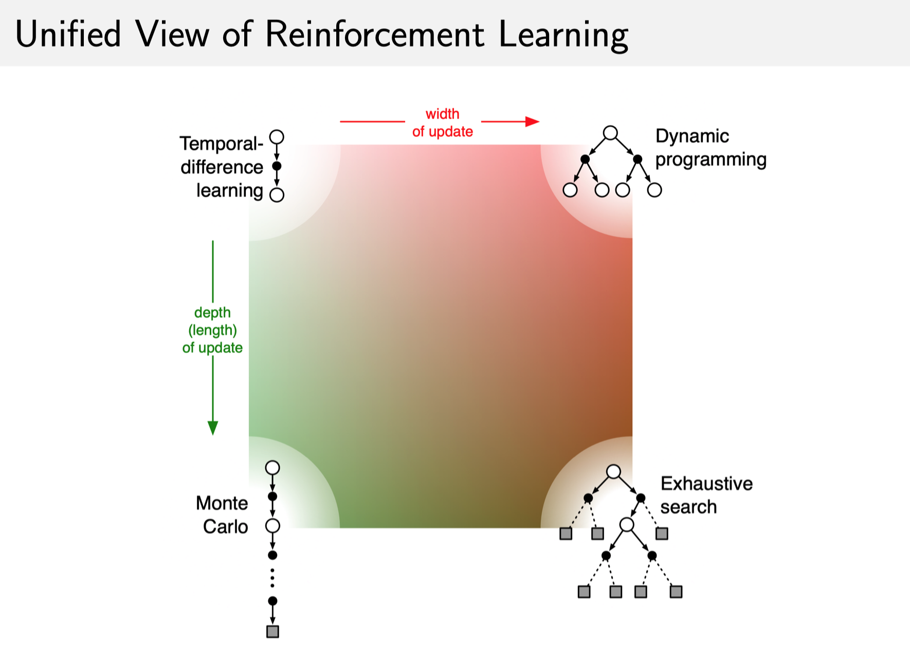

* 如果 TD 需要更广度的 update，就变成了 DP（因为 DP 是把所有状态都考虑进去来进行更新）。
* 如果 TD 需要更深度的 update，就变成了 MC。
* 右下角是穷举的方法（exhaustive search），穷举的方法既需要很深度的信息，又需要很广度的信息。

## Model-free Control

Q: 当我们不知道 MDP 模型情况下，如何优化价值函数，得到最佳的策略？

A: 我们可以把 policy iteration 进行一个广义的推广，使它能够兼容 MC 和 TD 的方法，即 `Generalized Policy Iteration(GPI) with MC and TD`。

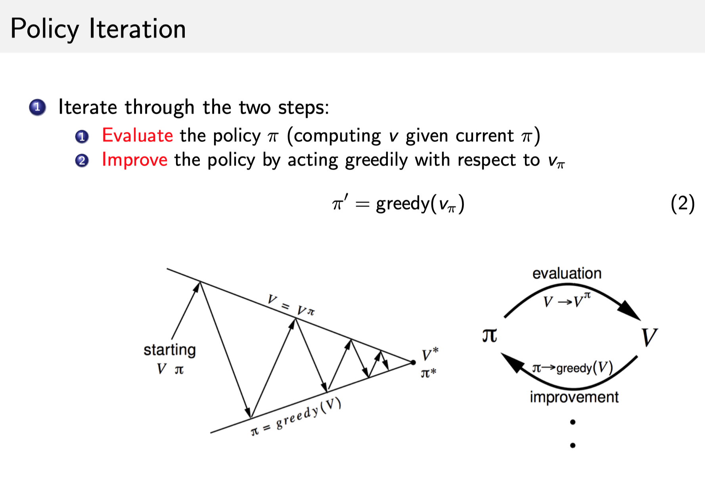

Policy iteration 由两个步骤组成：

1. 根据给定的当前的 policy $\pi$ 来估计价值函数；
2. 得到估计的价值函数后，通过 greedy 的方法来改进它的算法。

这两个步骤是一个互相迭代的过程。

得到一个价值函数过后，我们并不知道它的奖励函数和状态转移，所以就没法估计它的 Q 函数。所以这里有一个问题：当我们不知道奖励函数和状态转移时，如何进行策略的优化。

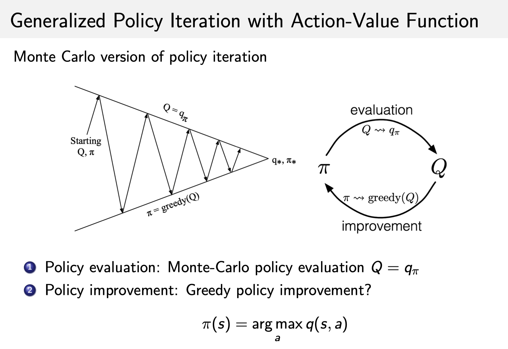

针对上述情况，我们引入了广义的 policy iteration 的方法。

我们对 policy evaluation 部分进行修改：用 MC 的方法代替 DP 的方法去估计 Q 函数。

当得到 Q 函数后，就可以通过 greedy 的方法去改进它。

上图是用 MC 估计 Q 函数的算法。

* 假设每一个 episode 都有一个 `exploring start`，exploring start 保证所有的状态和动作都在无限步的执行后能被采样到，这样才能很好地去估计。
* 算法通过 MC 的方法产生了很多的轨迹，每个轨迹都可以算出它的价值。然后，我们可以通过 average 的方法去估计 Q 函数。Q 函数可以看成一个 Q-table，通过采样的方法把表格的每个单元的值都填上，然后我们使用 policy improvement 来选取更好的策略。
* 算法核心：如何用 MC 方法来填 Q-table。

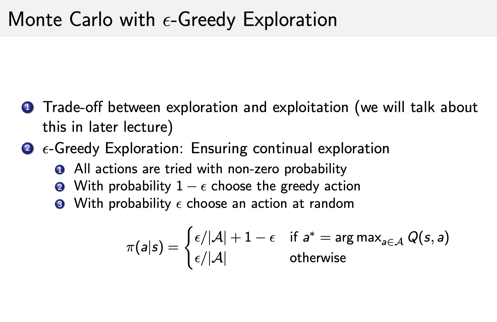

为了确保 MC 方法能够有足够的探索，我们使用了 $\varepsilon$-greedy exploration。

$\varepsilon\text{-greedy}$ 的意思是说，我们有 $1-\varepsilon$ 的概率会按照 Q-function 来决定 action，通常 $\varepsilon$ 就设一个很小的值， $1-\varepsilon$ 可能是 90%，也就是 90% 的概率会按照 Q-function 来决定 action，但是你有 10% 的机率是随机的。通常在实现上 $\varepsilon$ 会随着时间递减。在最开始的时候。因为还不知道那个 action 是比较好的，所以你会花比较大的力气在做 exploration。接下来随着 training 的次数越来越多。已经比较确定说哪一个 Q 是比较好的。你就会减少你的 exploration，你会把 $\varepsilon$ 的值变小，主要根据 Q-function 来决定你的 action，比较少做 random，这是 $\varepsilon\text{-greedy}$。

当我们使用 MC 和 $\varepsilon$-greedy 探索这个形式的时候，我们可以确保价值函数是单调的，改进的。

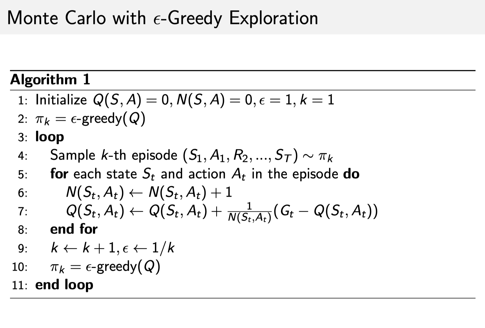上图是 MC with $\varepsilon$-greedy exploration 算法的伪代码。

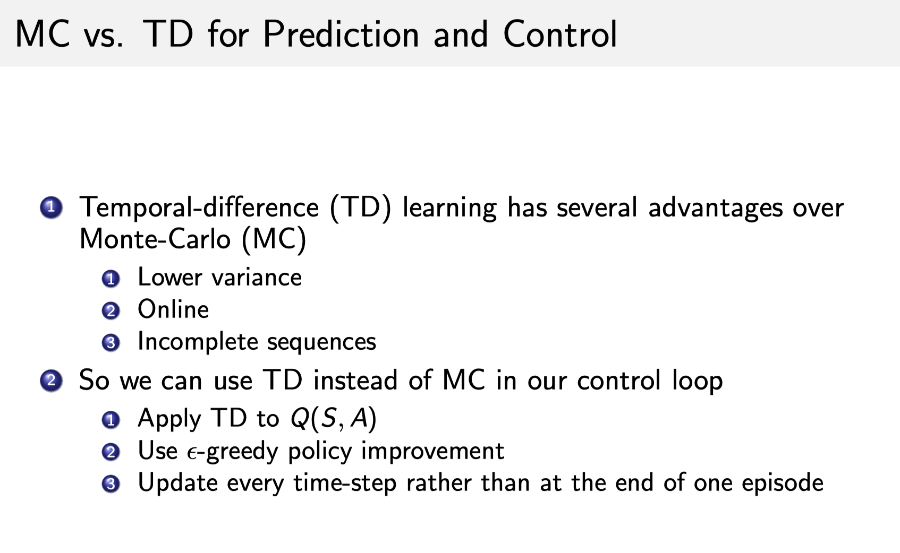

与 MC 相比，TD 有如下几个优势：

* 低方差。
* 能够在线学习。
* 能够从不完整的序列学习。

所以我们可以把 TD 也放到 control loop 里面去估计 Q-table，再采取这个 $\varepsilon$-greedy improvement。这样就可以在 episode 没结束的时候来更新已经采集到的状态价值。  

### Sarsa: On-policy TD Control

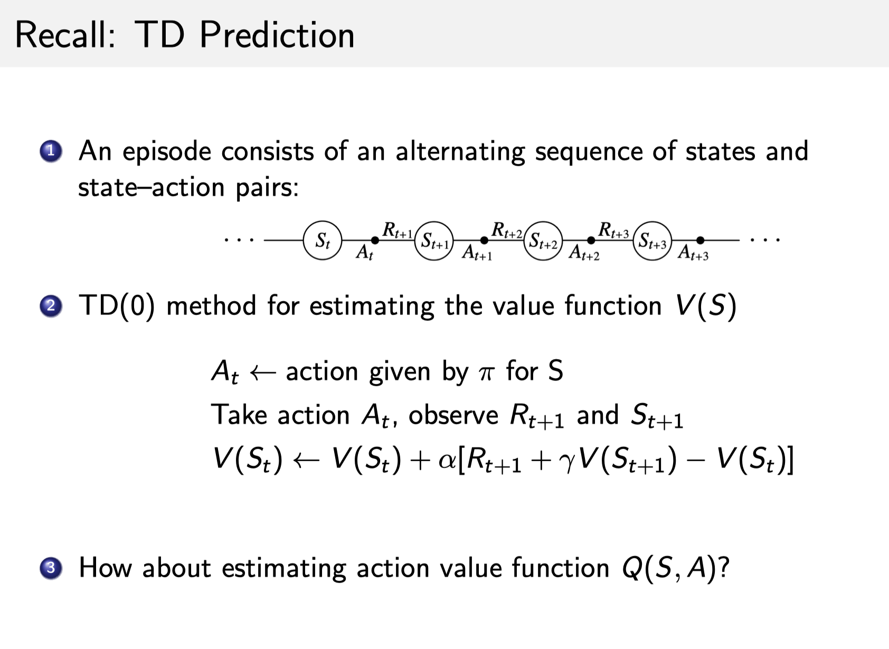

TD 是给定了一个策略，然后我们去估计它的价值函数。接着我们要考虑怎么用 TD 这个框架来估计 Q-function。

Sarsa 所作出的改变很简单，就是将原本我们 TD 更新 V 的过程，变成了更新 Q，如下式所示：

$$
Q\left(S_{t}, A_{t}\right) \leftarrow Q\left(S_{t}, A_{t}\right)+\alpha\left[R_{t+1}+\gamma Q\left(S_{t+1}, A_{t+1}\right)-Q\left(S_{t}, A_{t}\right)\right]
$$
这个公式就是说可以拿下一步的 Q 值 $Q(S_{t+_1},A_{t+1})$ 来更新我这一步的 Q 值 $Q(S_t,A_t)$ 。

Sarsa 是直接估计 Q-table，得到 Q-table 后，就可以更新策略。

为了理解这个公式，如上图所示，我们先把 $R_{t+1}+\gamma Q\left(S_{t+1}, A_{t+1}\right.)$ 当作是一个目标值，就是 $Q(S_t,A_t)$ 想要去逼近的一个目标值。$R_{t+1}+\gamma Q\left(S_{t+1}, A_{t+1}\right.)$ 就是 TD target。

我们想要计算的就是 $Q(S_t,A_t)$ 。因为最开始 Q 值都是随机初始化或者是初始化为零，它需要不断地去逼近它理想中真实的 Q 值(TD target)，$R_{t+1}+\gamma Q\left(S_{t+1}, A_{t+1}\right)-Q\left(S_{t}, A_{t}\right)$ 就是 TD error。

也就是说，我们拿 $Q(S_t,A_t)$ 来逼近 $G_t$，那 $Q(S_{t+1},A_{t+1})$ 其实就是近似 $G_{t+1}$。我就可以用  $Q(S_{t+1},A_{t+1})$ 近似 $G_{t+1}$，然后把  $R_{t+1}+Q(S_{t+1},A_{t+1})$  当成目标值。

$Q(S_t,A_t)$  就是要逼近这个目标值，我们用软更新的方式来逼近。软更新的方式就是每次我只更新一点点，$\alpha$ 类似于学习率。最终的话，Q 值都是可以慢慢地逼近到真实的 target 值。这样我们的更新公式只需要用到当前时刻的 $S_{t},A_t$，还有拿到的 $R_{t+1}, S_{t+1}，A_{t+1}$ 。

**该算法由于每次更新值函数需要知道当前的状态(state)、当前的动作(action)、奖励(reward)、下一步的状态(state)、下一步的动作(action)，即 $(S_{t}, A_{t}, R_{t+1}, S_{t+1}, A_{t+1})$ 这几个值 ，由此得名 `Sarsa` 算法**。它走了一步之后，拿到了 $(S_{t}, A_{t}, R_{t+1}, S_{t+1}, A_{t+1})$  之后，就可以做一次更新。

我们直接看这个框框里面的更新公式， 和之前的公式是一样的。$S'$ 就是 $S_{t+1}$ 。我们就是拿下一步的 Q 值 $Q(S',A')$ 来更新这一步的 Q 值 $Q(S,A)$，不断地强化每一个 Q。

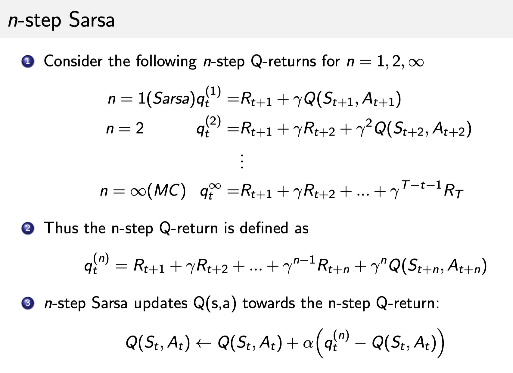Sarsa 属于单步更新法，也就是说每执行一个动作，就会更新一次价值和策略。如果不进行单步更新，而是采取 $n$ 步更新或者回合更新，即在执行 $n$ 步之后再来更新价值和策略，这样就得到了 `n 步 Sarsa(n-step Sarsa)`。

比如 2-step Sarsa，就是执行两步后再来更新 Q 的值。

具体来说，对于 Sarsa，在 $t$ 时刻其价值的计算公式为
$$
q_{t}=R_{t+1}+\gamma Q\left(S_{t+1}, A_{t+1}\right)
$$
而对于 $n$ 步 Sarsa，它的 $n$ 步 Q 收获为
$$
q_{t}^{(n)}=R_{t+1}+\gamma R_{t+2}+\ldots+\gamma^{n-1} R_{t+n}+\gamma^{n} Q\left(S_{t+n}, A_{t+n}\right)
$$

如果给 $q_t^{(n)}$ 加上衰减因子 $\lambda$ 并进行求和，即可得到 Sarsa($\lambda$) 的 Q 收获：
$$
q_{t}^{\lambda}=(1-\lambda) \sum_{n=1}^{\infty} \lambda^{n-1} q_{t}^{(n)}
$$
因此，$n$ 步 Sarsa($\lambda$)的更新策略可以表示为
$$
Q\left(S_{t}, A_{t}\right) \leftarrow Q\left(S_{t}, A_{t}\right)+\alpha\left(q_{t}^{\lambda}-Q\left(S_{t}, A_{t}\right)\right)
$$
总的来说，Sarsa 和 Sarsa($\lambda$) 的差别主要体现在价值的更新上。

我们看看用代码去怎么去实现。了解单步更新的一个基本公式之后，代码实现就很简单了。右边是环境，左边是 agent 。我们每次跟环境交互一次之后呢，就可以 learn 一下，向环境输出 action，然后从环境当中拿到 state 和 reward。Agent 主要实现两个方法：

* 一个就是根据 Q 表格去选择动作，输出 action。
* 另外一个就是拿到 $(S_{t}, A_{t}, R_{t+1}, S_{t+1}, A_{t+1})$  这几个值去更新我们的 Q 表格。

### Q-learning: Off-policy TD Control

Sarsa 是一种 on-policy 策略。Sarsa 优化的是它实际执行的策略，它直接拿下一步会执行的 action 来去优化 Q 表格，所以 on-policy 在学习的过程中，只存在一种策略，它用一种策略去做 action 的选取，也用一种策略去做优化。所以 Sarsa 知道它下一步的动作有可能会跑到悬崖那边去，所以它就会在优化它自己的策略的时候，会尽可能的离悬崖远一点。这样子就会保证说，它下一步哪怕是有随机动作，它也还是在安全区域内。

而 off-policy 在学习的过程中，有两种不同的策略:

* 第一个策略是我们需要去学习的策略，即`target policy(目标策略)`，一般用 $\pi$ 来表示，Target policy 就像是在后方指挥战术的一个军师，它可以根据自己的经验来学习最优的策略，不需要去和环境交互。
* 另外一个策略是探索环境的策略，即`behavior policy(行为策略)`，一般用 $\mu$ 来表示。$\mu$ 可以大胆地去探索到所有可能的轨迹，采集轨迹，采集数据，然后把采集到的数据喂给 target policy 去学习。而且喂给目标策略的数据中并不需要 $A_{t+1}$ ，而 Sarsa 是要有 $A_{t+1}$ 的。Behavior policy 像是一个战士，可以在环境里面探索所有的动作、轨迹和经验，然后把这些经验交给目标策略去学习。比如目标策略优化的时候，Q-learning 不会管你下一步去往哪里探索，它就只选收益最大的策略。

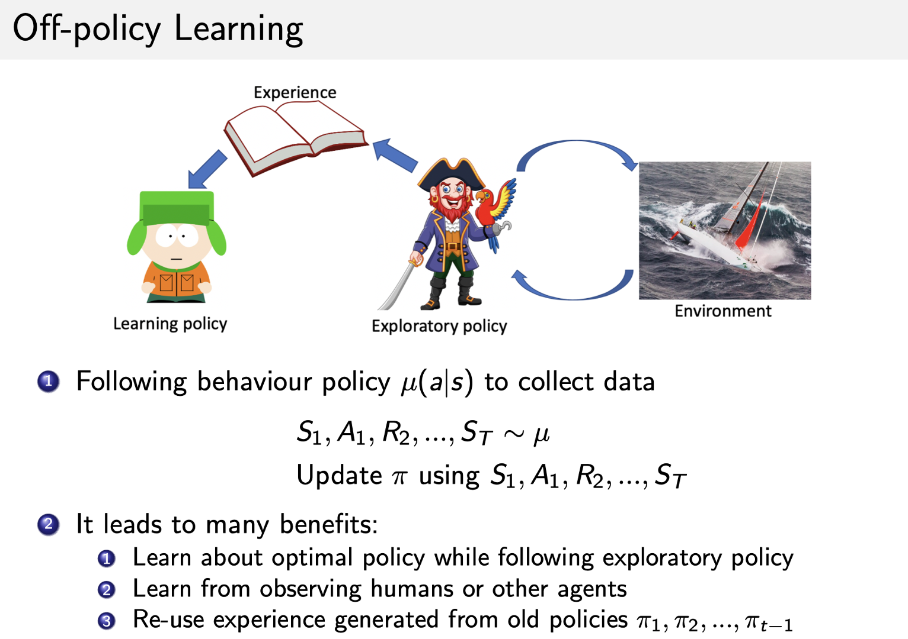

再举个例子。比如环境是一个波涛汹涌的大海，但 learning policy 太胆小了，没法直接跟环境去学习，所以我们有了 exploratory policy，exploratory policy 是一个不畏风浪的海盗，他非常激进，可以在环境中探索。他有很多经验，可以把这些经验写成稿子，然后喂给这个 learning policy。Learning policy 可以通过这个稿子来进行学习。

在 off-policy learning 的过程中，我们这些轨迹都是 behavior policy 跟环境交互产生的，产生这些轨迹后，我们使用这些轨迹来更新 target policy $\pi$。

**Off-policy learning 有很多好处：**

* 我们可以利用 exploratory policy 来学到一个最佳的策略，学习效率高；
* 可以让我们学习其他 agent 的行为，模仿学习，学习人或者其他 agent 产生的轨迹；
* 重用老的策略产生的轨迹。探索过程需要很多计算资源，这样的话，可以节省资源。

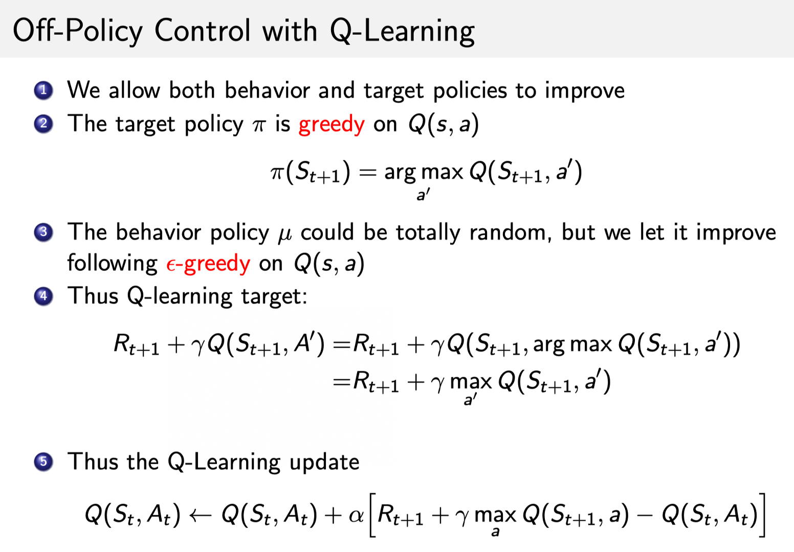

Q-learning 有两种 policy：behavior policy 和 target policy。

Target policy $\pi$ 直接在 Q-table 上取 greedy，就取它下一步能得到的所有状态，如下式所示：
$$
\pi\left(S_{t+1}\right)=\underset{a^{\prime}}{\arg \max}~ Q\left(S_{t+1}, a^{\prime}\right)
$$
Behavior policy $\mu$ 可以是一个随机的 policy，但我们采取 $\varepsilon\text{-greedy}$，让 behavior policy 不至于是完全随机的，它是基于 Q-table 逐渐改进的。

我们可以构造 Q-learning target，Q-learning 的 next action 都是通过 arg max 操作来选出来的，于是我们可以代入 arg max 操作，可以得到下式：
$$
\begin{aligned}
R_{t+1}+\gamma Q\left(S_{t+1}, A^{\prime}\right) &=R_{t+1}+\gamma Q\left(S_{t+1},\arg \max ~Q\left(S_{t+1}, a^{\prime}\right)\right) \\
&=R_{t+1}+\gamma \max _{a^{\prime}} Q\left(S_{t+1}, a^{\prime}\right)
\end{aligned}
$$
接着我们可以把 Q-learning update 写成 incremental learning 的形式，TD target 就变成 max 的值，即
$$
Q\left(S_{t}, A_{t}\right) \leftarrow Q\left(S_{t}, A_{t}\right)+\alpha\left[R_{t+1}+\gamma \max _{a} Q\left(S_{t+1}, a\right)-Q\left(S_{t}, A_{t}\right)\right]
$$

 **我们再通过对比的方式来进一步理解 `Q-learning`。Q-learning 是 off-policy 的时序差分学习方法，Sarsa 是 on-policy 的时序差分学习方法。**

* Sarsa 在更新 Q 表格的时候，它用到的 A' 。我要获取下一个 Q 值的时候，A' 是下一个 step 一定会执行的 action。这个 action 有可能是 $\varepsilon$-greedy 方法 sample 出来的值，也有可能是 max Q 对应的 action，也有可能是随机动作，但这是它实际执行的那个动作。
* 但是 Q-learning 在更新 Q 表格的时候，它用到这个的 Q 值 $Q(S',a)$ 对应的那个 action ，它不一定是下一个 step 会执行的实际的 action，因为你下一个实际会执行的那个 action 可能会探索。
* Q-learning 默认的 next action 不是通过 behavior policy 来选取的，Q-learning 直接看 Q-table，取它的 max 的这个值，它是默认 A' 为最优策略选的动作，所以 Q-learning 在学习的时候，不需要传入 A'，即 $A_{t+1}$  的值。

> 事实上，Q-learning 算法被提出的时间更早，Sarsa 算法是 Q-learning 算法的改进。

**Sarsa 和 Q-learning 的更新公式都是一样的，区别只在 target 计算的这一部分，**

* Sarsa 是 $R_{t+1}+\gamma Q(S_{t+1}, A_{t+1})$  ；
* Q-learning 是 $R_{t+1}+\gamma  \underset{a}{\max} Q\left(S_{t+1}, a\right)$ 。

Sarsa 是用自己的策略产生了 S,A,R,S',A' 这一条轨迹。然后拿着 $Q(S_{t+1},A_{t+1})$ 去更新原本的 Q 值 $Q(S_t,A_t)$。 

但是 Q-learning 并不需要知道我实际上选择哪一个 action ，它默认下一个动作就是 Q 最大的那个动作。Q-learning 知道实际上 behavior policy 可能会有 10% 的概率去选择别的动作，但 Q-learning 并不担心受到探索的影响，它默认了就按照最优的策略来去优化目标策略，所以它可以更大胆地去寻找最优的路径，它会表现得比 Sarsa 大胆非常多。

对 Q-learning 进行逐步地拆解的话，跟 Sarsa 唯一一点不一样就是并不需要提前知道 $A_2$ ，我就能更新 $Q(S_1,A_1)$ 。在训练一个 episode 这个流程图当中，Q-learning 在 learn 之前它也不需要去拿到 next action $A'$，它只需要前面四个 $ (S,A,R,S')$ ，这跟 Sarsa 很不一样。 
## On-policy vs. Off-policy

**总结一下 on-policy 和 off-policy 的区别。**

* Sarsa 是一个典型的 on-policy 策略，它只用了一个 policy $\pi$ 。如果 policy 采用 $\varepsilon$-greedy 算法的话，它需要兼顾探索，为了兼顾探索和利用，它训练的时候会显得有点胆小。它在解决悬崖问题的时候，会尽可能地离悬崖边上远远的，确保说哪怕自己不小心探索了一点，也还是在安全区域内。此外，因为采用的是 $\varepsilon$-greedy 算法，策略会不断改变($\varepsilon$ 会不断变小)，所以策略不稳定。
* Q-learning 是一个典型的 off-policy 的策略，它有两种策略：target policy 和 behavior policy。它分离了目标策略跟行为策略。Q-learning 就可以大胆地用 behavior policy 去探索得到的经验轨迹来去优化目标策略，从而更有可能去探索到最优的策略。Behavior policy 可以采用 $\varepsilon$-greedy 算法，但 target policy 采用的是 greedy 算法，直接根据 behavior policy 采集到的数据来采用最优策略，所以 Q-learning 不需要兼顾探索。
* 比较 Q-learning 和 Sarsa 的更新公式可以发现，Sarsa 并没有选取最大值的 max 操作，因此，
  * Q-learning 是一个非常激进的算法，希望每一步都获得最大的利益；
  * 而 Sarsa 则相对非常保守，会选择一条相对安全的迭代路线。

## Summary
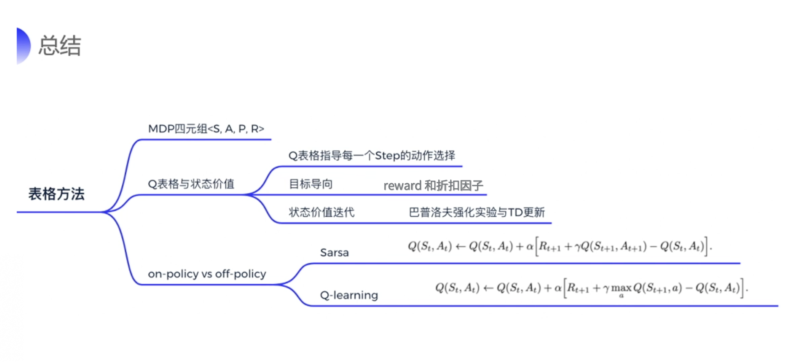

总结如上图所示。

## References

* [强化学习基础 David Silver 笔记](https://zhuanlan.zhihu.com/c_135909947)
* [Intro to Reinforcement Learning (强化学习纲要）](https://github.com/zhoubolei/introRL)
* [Reinforcement Learning: An Introduction (second edition)](https://book.douban.com/subject/30323890/)
* [百面深度学习](https://book.douban.com/subject/35043939/)
* [神经网络与深度学习](https://nndl.github.io/)
* [机器学习](https://book.douban.com/subject/26708119//)

