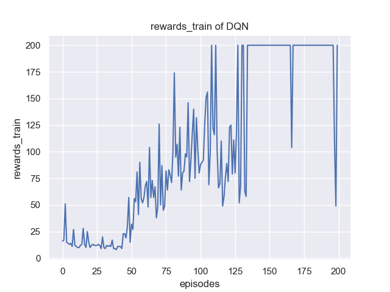
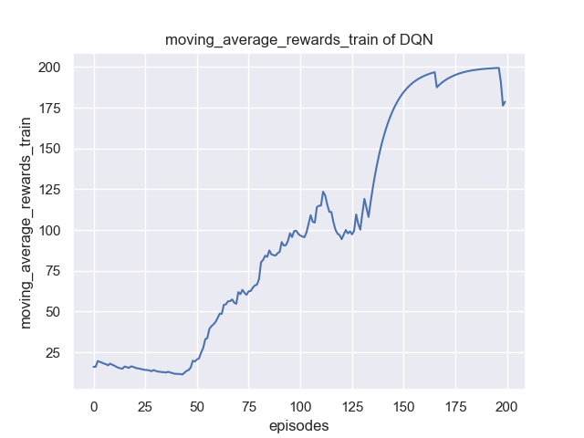
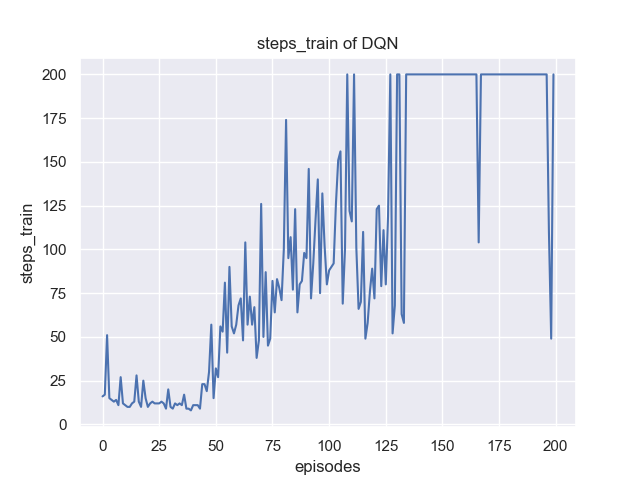
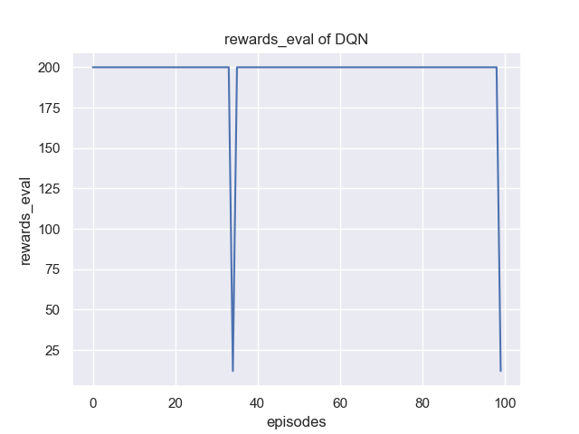
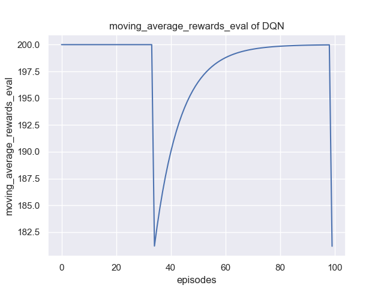
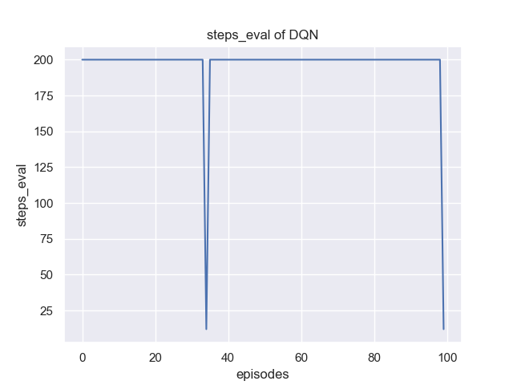
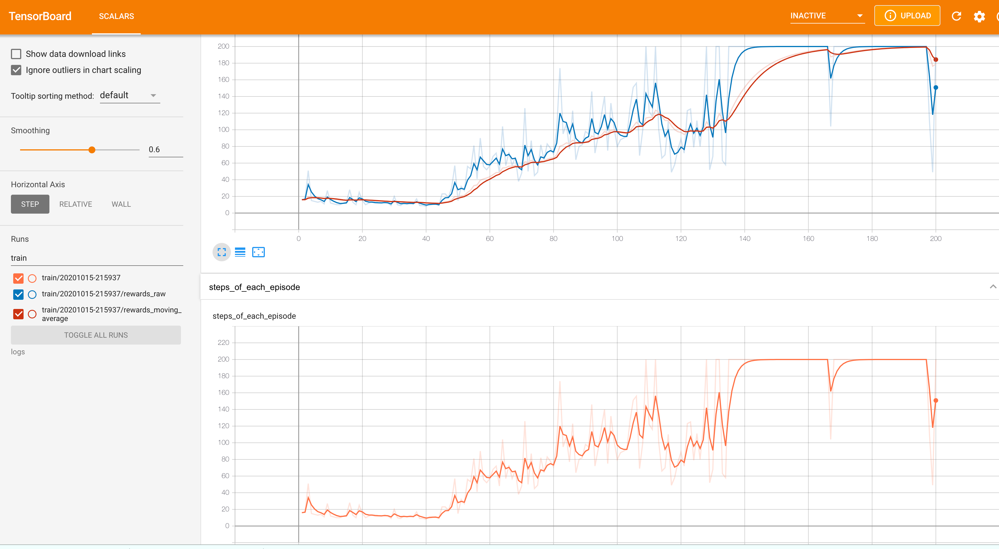

# 使用DQN实现CartPole-v0

推荐使用Double-DQN去解决，即建立两个初始参数相同的全连接网络target_net和policy_net。

## CartPole-v0

CartPole-v0是OpenAI gym中的一个经典环境，通过向左(action=0)或向右(action=1)推车能够实现平衡，所以动作空间由两个动作组成。每进行一个step就会给一个reward，如果无法保持平衡那么done等于true，本次episode失败。理想状态下，每个episode至少能进行200个step，也就是说每个episode的reward总和至少为200，step数目至少为200。


环境建立如下：

```python
env = gym.make('CartPole-v0') 
env.seed(1) # 设置env随机种子
n_states = env.observation_space.shape[0] # 获取总的状态数
n_actions = env.action_space.n # 获取总的动作数
```

## 强化学习基本接口

```python
rewards = [] # 记录总的rewards
moving_average_rewards = [] # 记录总的经滑动平均处理后的rewards
ep_steps = []
for i_episode in range(1, cfg.max_episodes+1): # cfg.max_episodes为最大训练的episode数
    state = env.reset() # reset环境状态
    ep_reward = 0
    for i_step in range(1, cfg.max_steps+1): # cfg.max_steps为每个episode的补偿
        action = agent.select_action(state) # 根据当前环境state选择action
        next_state, reward, done, _ = env.step(action) # 更新环境参数
        ep_reward += reward
        agent.memory.push(state, action, reward, next_state, done) # 将state等这些transition存入memory
        state = next_state # 跳转到下一个状态
        agent.update() # 每步更新网络
        if done:
            break
    # 更新target network，复制DQN中的所有weights and biases
    if i_episode % cfg.target_update == 0: #  cfg.target_update为target_net的更新频率
        agent.target_net.load_state_dict(agent.policy_net.state_dict())
    print('Episode:', i_episode, ' Reward: %i' %
          int(ep_reward), 'n_steps:', i_step, 'done: ', done,' Explore: %.2f' % agent.epsilon)
    ep_steps.append(i_step)
    rewards.append(ep_reward)
    # 计算滑动窗口的reward
    if i_episode == 1:
        moving_average_rewards.append(ep_reward)
    else:
        moving_average_rewards.append(
            0.9*moving_average_rewards[-1]+0.1*ep_reward)
```

## 任务要求

训练并绘制reward以及滑动平均后的reward随episode的变化曲线图并记录超参数写成报告，图示如下：







同时也可以绘制测试(eval)模型时的曲线：







也可以[tensorboard](https://pytorch.org/docs/stable/tensorboard.html)查看结果，如下：



### 代码清单

**main.py**：保存强化学习基本接口，以及相应的超参数，可使用argparse

**model.py**：保存神经网络，比如全链接网络

**dqn.py**: 保存算法模型，主要包含select_action和update两个函数

**memory.py**：保存Replay Buffer

**plot.py**：保存相关绘制函数，可选

[参考代码](https://github.com/datawhalechina/leedeeprl-notes/tree/master/codes/dqn)